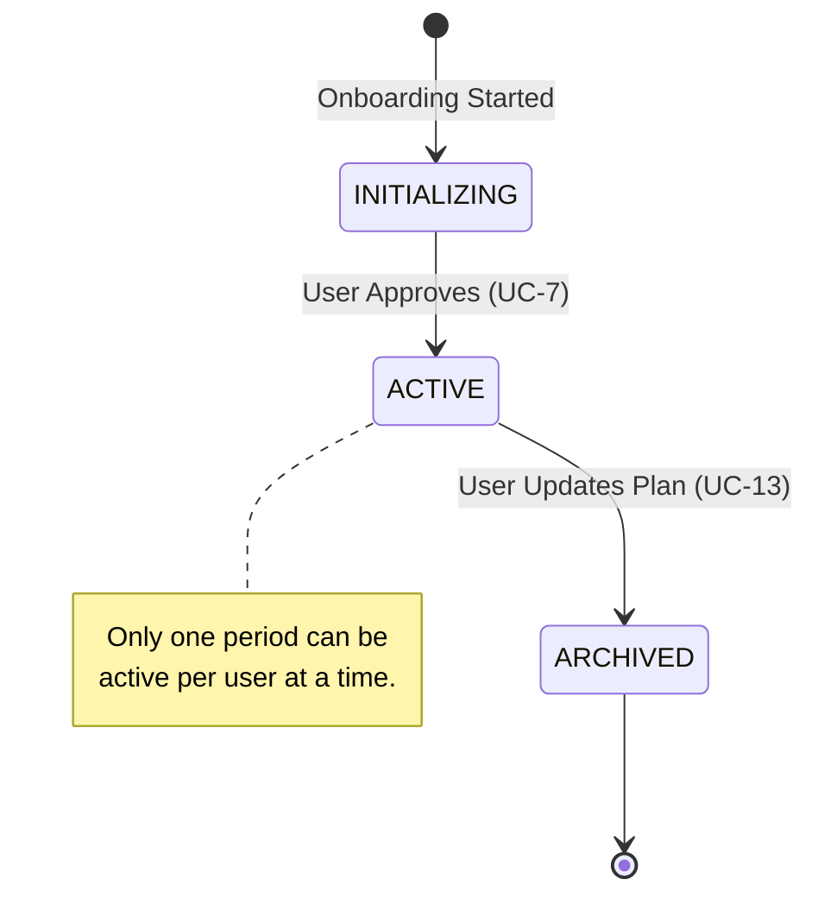

# Business Analysis - Cal AI

## 1. Product Vision

Cal AI is an AI-powered calorie and macronutrient tracking application. Users photograph their meals, and Google Gemini AI identifies the food, estimates nutrition, and logs it against personalised daily targets. The system calculates targets through a science-based onboarding flow (Mifflin-St Jeor + activity multiplier) and provides an AI nutrition coach for real-time guidance.

---

## 2. Stakeholders

| Stakeholder | Role | Interest |
|---|---|---|
| Dieter | Primary consumer | Track calories, reach fitness/health goals |
| System Administrator | System operator | Manage users, oversee platform |
| AI Provider (Google Gemini) | External service | Provides meal image analysis and chat coaching |
| Image Host (freeimage.host) | External service | Stores uploaded meal photos |
| DevOps / SRE | Operations | Monitor uptime, performance, error rates |

---

## 3. Business Goals

| # | Goal | Success Metric |
|---|------|---------------|
| BG-1 | Help users reach daily calorie/macro targets | % of days where user stays within +/- 10% of target |
| BG-2 | Reduce friction of meal logging | < 30 seconds from photo to logged meal |
| BG-3 | Provide accurate nutritional estimates via AI | AI confidence score > 0.7 on average |
| BG-4 | Personalise targets based on user profile | All active users have custom (non-default) targets |
| BG-5 | Enable data-driven health decisions | Users review history/analytics at least weekly |

---

## 4. Scientific Methodology (Adaptive Coaching Engine)
Cal AI transitions from a static calculator to a dynamic coaching system by implementing biological feedback loops as defined in clinical literature (Hall KD, PMC2376744).

### 4.1. Weight Smoothing Algorithm (Noise Reduction)
**Problem:** Daily body weight is volatile due to water retention, salt intake, and glycogen flux.
**Scientific Solution:** Exponential Moving Average (EMA).
**Formula:**
$$W_{trend, t} = \alpha \cdot W_{actual, t} + (1 - \alpha) \cdot W_{trend, t-1}$$
*(Where $\alpha = 0.1$ minimizes variance while maintaining responsiveness to real tissue change)*

### 4.2. Reverse Energy Induction (Adaptive TDEE)
**Principle:** The First Law of Thermodynamics (Energy Balance).
**Formula:**
$$TDEE_{real} = \text{Avg}(Calories\_In_{14d}) - \frac{\Delta W_{trend} \cdot \rho}{14}$$
- **$\rho$ (Energy Density):** Constrained at **7700 kcal/kg** (Wishnofsky's Rule).
- **Verification:** If $\Delta W = 0$ (Maintenance), then $TDEE = Calories\_In$.

### 4.3. Predictive Analytics (Plateau & Trajectory)
- **Plateau Prediction:** Defined by **Deficit Erosion**. Loss stalls when the gap between metabolic burn ($TDEE_{real}$) and energy intake ($Calories_{In}$) is too narrow. A plateau is triggered when $(TDEE - Intake) \le 100 \text{ kcal}$.
- **Trajectory Projection:** Calculated via dynamic integration: $W_{n} = W_{n-1} + \frac{(Target - TDEE_{dynamic, n})}{7700}$. $TDEE_{dynamic}$ decreases as weight is lost ($\approx 22 \text{ kcal/kg}$) to account for metabolic slowdown (Adaptive Thermogenesis).

---

---

## 5. Process Analysis

### 5.1. As-Is Process (Manual Nutrition Tracking)

The legacy manual process lacks noise filtering and scientific adjustment.

```mermaid
activityDiagram
    start
    :Dieter records weight and food manually:;
    :Calculate deficit via static formula:;
    if (Weight doesn't drop?) then (Yes)
        :Dieter gets confused/disheartened;
        :Manual guess on calorie reduction;
    else (No)
        :Continue static routine;
    endif
    stop
```

### 5.2. To-Be Process (Adaptive Cal AI Integration)

The proposed solution implements a feedback loop to automate scientific adjustments.

```mermaid
activityDiagram
    start
    :Dieter logs weight and food photos:;
    :AI Engine calculates daily macros:;
    :Scientific Engine filters weight noise (EMA):;
    if (14-day data window complete?) then (Yes)
        :Retrieve TDEE via Reverse Induction;
        :Compare actual vs predicted trajectory;
        if (Plateau predicted?) then (Yes)
            :Trigger Metabolic Recovery advice;
        else (No)
            :Auto-adjust Target for next week;
        endif
    else (No)
        :Maintain latest target;
    endif
    :Update Dieter Dashboard;
    stop
```

### 5. Business Domain Model

```
+-------------------+       1    *  +-------------------+
|       User        |------------->|       Meal        |
|-------------------|              |-------------------|
| email, password   |              | name, foodItems[] |
| profile (age,     |              | calories, protein |
|   gender, height, |              | carbs, fats       |
|   weight, goal)   |              | healthScore (1-10)|
+-------------------+              | imageUrl          |
        |                          +-------------------+
        | 1    *
        v
+-------------------+
|   TargetPeriod    |
|-------------------|
| startDate, endDate|
| goal              |
| calories, protein |
| carbs, fats       |
+-------------------+
```

---

## 5. Key Business Rules

### BR-1: Onboarding & Target Calculation

- New users MUST complete onboarding before accessing the dashboard.
- BMR is calculated via Mifflin-St Jeor equation, adjusted by activity level (TDEE).
- Activity Level mapping: 0-2 workouts = sedentary (1.2), 3-5 = light (1.375), 6+ = moderate (1.55).
- Goal modifiers: weight_loss = -500 kcal (Safety floor: min 1200 kcal); muscle_gain = +500 kcal; maintenance = TDEE.
- Protein: 1.8 g/kg (maintenance), 2.0 g/kg (weight loss), 2.2 g/kg (muscle gain).
- Fats: 0.9 g/kg. Carbs: remaining calories / 4.
- Projected Date: calculated using 7700 kcal per 1kg of weight difference (targetWeight - current weight).

### BR-2: Meal Analysis

- Only images containing food are accepted; non-food images are rejected (`isFood: false`).
- AI returns: food items, calories, protein, carbs, fats, healthScore, confidence.
- Health score is clamped to 1-10 range.
- If AI fails, the error is surfaced to the user; the meal is NOT logged.

### BR-3: Meal Logging

- A meal is always associated with the current date/time.
- After logging, the daily summary is recalculated and returned.
- Health score: use AI-provided score if available, otherwise calculate from macro ratios.

### BR-4: Target Periods & History

- Targets are not stored per-day, but in `TargetPeriods` with a start/end date.
- The system queries the "active" target period for any given date (latest period starting on or before that date).
- Updating targets closes the previous period (sets `endDate`) and opens a new one.
- Remaining = max(0, target - consumed). Never negative.

### BR-5: Target Period Lifecycle (State Management)
To ensure historical data integrity, `TargetPeriod` follows a strict state transition to manage changes in user goals.



### BR-6: Authentication & Authorization

- JWT-based authentication. Tokens include user ID, email, role.
- Two roles: `user` (default), `admin`.
- Role-based endpoints: only admin can change user roles.
- Token is stored in localStorage; 401 responses trigger automatic logout.

### BR-6: History & Analytics

- Users can view daily summaries for any date range.
- Only dates with actual data (meals or custom targets) are returned.
- History is sorted most-recent-first.

### BR-7: AI Chat Coach

- The "Meat Coach" provides nutrition coaching focused on proteins/meats.
- Chat includes the user's current daily summary as context.
- Responses are limited to 180 words, plain text only.

---

## 6. Feature Matrix

| Feature | Module | Status |
|---------|--------|--------|
| User Registration & Login | Auth | Done |
| JWT Authentication & Guards | Auth | Done |
| Role-Based Access Control | Auth | Done |
| Onboarding Flow (6 steps) | Onboarding | Done |
| BMR/TDEE Target Calculation | Onboarding | Done |
| AI Meal Image Analysis | AI + Meals | Done |
| Meal Photo Upload & Storage | Image + Meals | Done |
| Meal Logging | Meals | Done |
| Daily Summary (targets/consumed/remaining) | Meals | Done |
| Target Period Tracking (Historical) | TargetPeriods | Done |
| Health Score (per meal) | Meals | Done |
| History & Date Range Queries | Meals | Done |
| Analytics Charts | Frontend (History) | Done |
| AI Nutrition Coach Chat | Chat + AI | Done |
| User Profile Management | Users | Done |
| Macro Target Updates | Users + Settings | Done |
| Error Monitoring (Sentry/GlitchTip) | Frontend Monitoring | Done |
| Performance Monitoring (Prometheus/Grafana) | Backend Monitoring | Done |
| Unit Tests (backend) | Tests | Done |
| Unit Tests (frontend) | Tests | Done |
| E2E Tests (Playwright) | Tests | Done |

---

## 7. Non-Functional Requirements

| Category | Requirement |
|----------|-------------|
| Performance | API response < 500ms (excluding AI calls); AI analysis < 10s |
| Availability | Health check endpoints (`/health`, `/health/ready`) for uptime monitoring |
| Security | Passwords hashed with bcrypt (10 rounds); JWT for stateless auth; no secrets in code |
| Observability | Prometheus metrics exposed at `/metrics`; Grafana dashboards; Sentry error tracking |
| Scalability | Stateless backend (horizontal scaling ready); PostgreSQL for persistence |
| Data Privacy | Authorization headers scrubbed from error reports; user context cleared on logout |

---

## 8. Risk Register

| Risk | Impact | Likelihood | Mitigation |
|------|--------|------------|------------|
| AI returns inaccurate nutrition data | User tracks wrong calories | Medium | Confidence score shown; user can re-analyze or manually edit |
| Google Gemini API downtime | Meal analysis unavailable | Low | Error handling with user-friendly message; meal can still be logged manually |
| Image hosting service failure | Meal photos not stored | Low | Meal logged without image URL; graceful degradation |
| JWT secret compromise | Full account takeover | Low | Secret via env var; rotate via deployment; monitor auth_attempts metric |
| Database unavailable | Complete service outage | Low | Health check alerts; Prometheus ServiceDown alert fires in 1 min |
