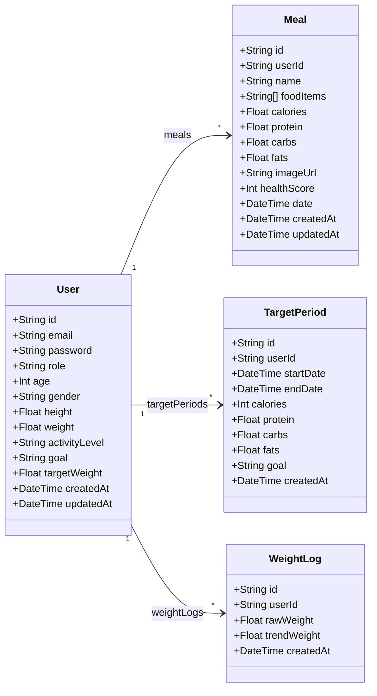
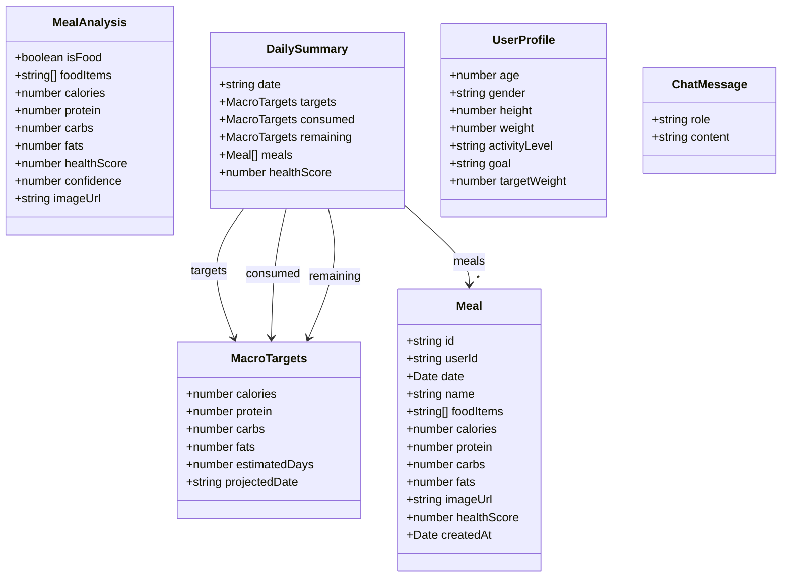
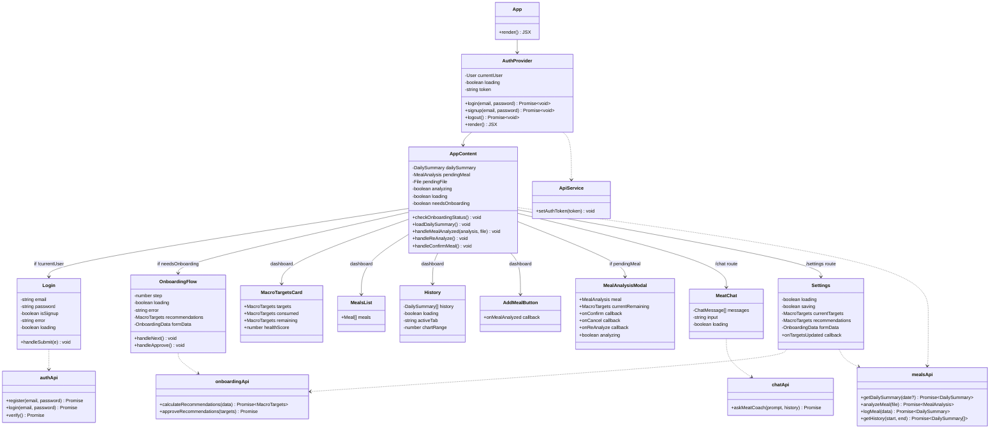
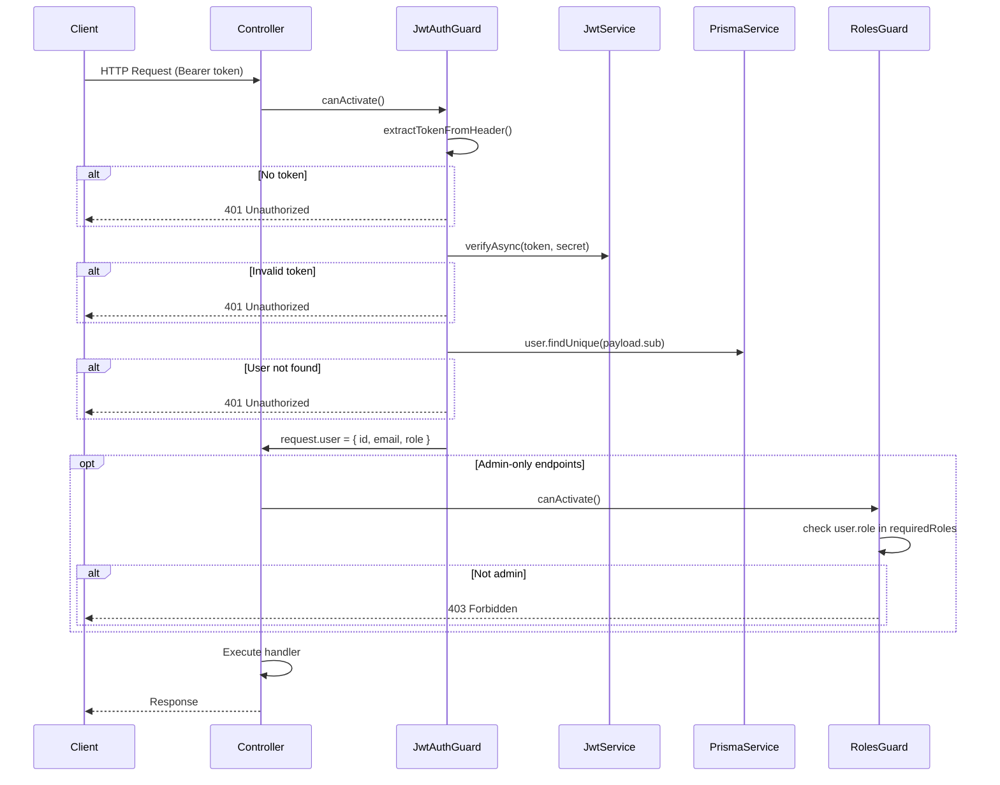
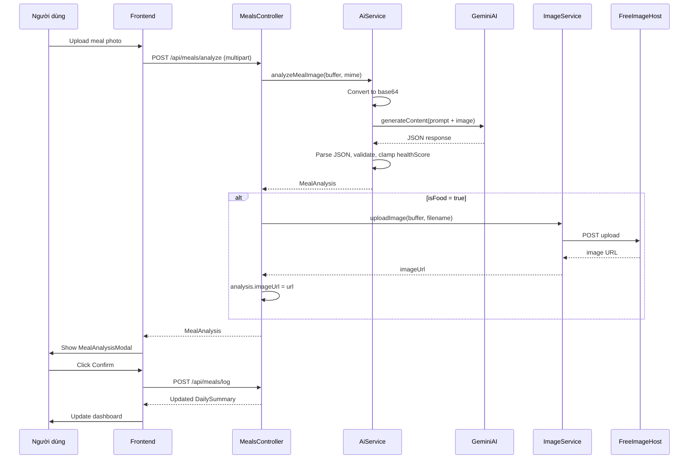

# Class UML Diagrams - Cal AI

All diagrams use [Mermaid](https://mermaid.js.org/) syntax and render on GitHub, GitLab, and most Markdown viewers.

---

## 1. Data Model (Prisma / Database)

---

## 2. Shared TypeScript Interfaces

---

## 3. Backend Services (NestJS)

```mermaid
classDiagram
    direction TB

    class AppModule {
        <<Module>>
    }

    class PrismaService {
        +onModuleInit() void
        +onModuleDestroy() void
    }

    class AuthService {
        -PrismaService prisma
        -JwtService jwtService
        +register(dto: RegisterDto) Promise
        +login(dto: LoginDto) Promise
        +validateUserById(userId: string) Promise
        -getUserByEmail(email: string) Promise
        -validateUser(email: string, password: string) Promise
    }

    class AuthController {
        -AuthService authService
        +register(dto: RegisterDto) Promise
        +login(dto: LoginDto) Promise
        +verifyToken(user: UserPayload) Promise
    }

    class UsersService {
        -PrismaService prisma
        +createUser(email, password, role) Promise
        +getUserById(id: string) Promise
        +getUserByEmail(email: string) Promise
        +validateUser(email, password) Promise
        +updateUserProfile(userId, profile) Promise~void~
        +updateUserTargets(userId, targets, goal) Promise~void~
        +updateUserRole(userId, role) Promise~void~
        +getUserTargets(userId) Promise~MacroTargets~
    }

    class UsersController {
        -UsersService usersService
        +getCurrentUser(user) Promise
        +updateProfile(user, profile) Promise
        +updateTargets(user, targets) Promise
        +updateUserRole(body) Promise
    }

    class MealsService {
        -PrismaService prisma
        +getDailySummary(userId, date?) Promise~DailySummary~
        +getHistory(userId, startDate, endDate) Promise~DailySummary[]~
        -calculateHealthScore(meal) number
    }

    class MealsController {
        -MealsService mealsService
        -AiService aiService
        -ImageService imageService
        +getDailySummary(user, date?) Promise
        +analyzeMeal(file) Promise~MealAnalysis~
        +getTodayMeals(user) Promise
        +logMeal(user, dto) Promise
        +getHistory(user, startDate, endDate) Promise
    }

    class AiService {
        -GoogleGenerativeAI genAI
        -model any
        +analyzeMealImage(buffer, mimeType) Promise~MealAnalysis~
        +generateMeatCoachAdvice(prompt, history?, summary?) Promise~string~
        -stripMarkdown(text) string
        -formatClientContext(summary?) string
    }

    class ImageService {
        -string apiKey
        -string uploadUrl
        +uploadImage(buffer, filename?) Promise~string~
        +uploadImageFromBase64(base64, filename?) Promise~string~
    }

    class OnboardingService {
        +calculateRecommendations(data: OnboardingData) OnboardingRecommendations
        -calculateAge(birthDate) number
        -mapWorkoutsToActivityLevel(workouts) string
        -calculateBMR(weight, height, age, gender) number
        -calculateTDEE(bmr, activityLevel) number
        -adjustCaloriesForGoal(tdee, goal) number
        -calculateMacros(calories, weight, goal) object
    }

    class OnboardingController {
        -OnboardingService onboardingService
        -UsersService usersService
        -TargetPeriodsService targetPeriodsService
        +calculateRecommendations(data) Promise~MacroTargetsDto~
        +approveRecommendations(user, targets) Promise
    }

    class TargetPeriodsService {
        -PrismaService prisma
        +getTargetsForDate(userId, date) Promise~MacroTargets~
    }

    class ScientificService {
        +calculateEMA(rawCurrent, trendPrevious) number
        +calculateAdaptiveTDEE(meals, weights) number
        +predictPlateau(tdeeReal, tdeeInitial) boolean
        +getTrajectory(currentWeight, target, tdeeReal) TrajectoryPoint[]
    }

    class ChatMealSummaryService {
        -PrismaService prisma
        -TargetPeriodsService targetPeriodsService
        +getDailySummary(userId, date?) Promise~DailySummary~
        -findMealsByDate(userId, date) Promise~Meal[]~
    }

    class MetricsService {
        +Registry registry
        +Histogram httpRequestDuration
        +Counter httpRequestTotal
        +Counter httpRequestErrors
        +Counter mealsLogged
        +Counter mealAnalysisTotal
        +Histogram mealAnalysisDuration
        +Counter chatMessagesTotal
        +Gauge activeUsers
        +Counter authAttempts
        +Counter registrations
        +getMetrics() Promise~string~
        +getContentType() string
    }

    class MetricsController {
        -MetricsService metricsService
        +getMetrics(res) Promise
        +getHealth() object
        +getReadiness() object
    }

    %% Guards
    class JwtAuthGuard {
        -JwtService jwtService
        -ConfigService configService
        -PrismaService prisma
        +canActivate(context) Promise~boolean~
        -extractTokenFromHeader(request) string
    }

    class RolesGuard {
        -Reflector reflector
        +canActivate(context) boolean
    }

    %% Relationships
    AppModule ..> AuthController
    AppModule ..> UsersController
    AppModule ..> MealsController
    AppModule ..> OnboardingController
    AppModule ..> ChatController
    AppModule ..> MetricsController

    AuthController --> AuthService
    AuthService --> PrismaService
    AuthService --> JwtAuthGuard

    UsersController --> UsersService
    UsersService --> PrismaService

    MealsController --> MealsService
    MealsController --> AiService
    MealsController --> ImageService
    MealsService --> PrismaService
    MealsService --> DailyTargetsService

    OnboardingController --> OnboardingService
    OnboardingController --> UsersService
    OnboardingController --> TargetPeriodsService

    MealsService --> ScientificService
    OnboardingService --> ScientificService
    ChatMealSummaryService --> ScientificService

    TargetPeriodsService --> PrismaService

    ChatController --> AiService
    ChatController --> ChatMealSummaryService
    ChatMealSummaryService --> PrismaService
    ChatMealSummaryService --> TargetPeriodsService

    MetricsController --> MetricsService

    JwtAuthGuard --> PrismaService
    UsersController --> RolesGuard
```

---

## 4. Frontend Components (React)

---

## 5. Authentication & Guard Flow

---

## 6. Meal Analysis Flow

