# Use Cases - Cal AI

## 1. Use Case Diagram

```mermaid
graph TB
    subgraph Actors
        U((User))
        A((Admin))
        AI((Google Gemini AI))
        IMG((Image Host))
    end

    subgraph "Authentication"
        UC1[UC-1: Register]
        UC2[UC-2: Login]
        UC3[UC-3: Verify Token]
        UC4[UC-4: Logout]
    end

    subgraph "Onboarding"
        UC5[UC-5: Complete Onboarding]
        UC6[UC-6: Calculate Macro Targets]
        UC7[UC-7: Approve Recommendations]
    end

    subgraph "Meal Management"
        UC8[UC-8: Analyze Meal Photo]
        UC9[UC-9: Log Meal]
        UC10[UC-10: View Daily Summary]
        UC11[UC-11: View Meal History]
    end

    subgraph "Target Management"
        UC12[UC-12: Manage User Profile]
        UC13[UC-13: Update Target Plan]
        UC17[UC-17: Recalculate Recommendations]
    end

    subgraph "Settings"
        UC16[UC-16: Chat with Nutrition Coach]
    end

    U --> UC1
    U --> UC2
    U --> UC3
    U --> UC4
    U --> UC5
    U --> UC8
    U --> UC9
    U --> UC10
    U --> UC11
    U --> UC12
    U --> UC13
    U --> UC16
    U --> UC17

    UC5 --> UC6
    UC5 --> UC7
    UC8 --> AI
    UC8 --> IMG
    UC16 --> AI
    UC17 --> UC6
```

---

## 2. Use Case Descriptions

### UC-1: Register

| Field | Value |
|-------|-------|
| **Actor** | User |
| **Precondition** | User has no existing account |
| **Trigger** | User clicks "Sign Up" |
| **Main Flow** | 1. User enters email and password 2. System validates email uniqueness 3. System hashes password (bcrypt, 10 rounds) 4. System creates user with role "user" 5. System generates JWT token 6. System returns token + user info |
| **Postcondition** | User is authenticated; token stored in localStorage |
| **Exception** | E1: Email already exists -> UnauthorizedException |

---

### UC-2: Login

| Field | Value |
|-------|-------|
| **Actor** | User |
| **Precondition** | User has a registered account |
| **Trigger** | User clicks "Sign In" |
| **Main Flow** | 1. User enters email and password 2. System looks up user by email 3. System compares password hash with bcrypt 4. System generates JWT token 5. System returns token + user info |
| **Postcondition** | User is authenticated |
| **Exception** | E1: Email not found -> UnauthorizedException E2: Wrong password -> UnauthorizedException |

---

### UC-3: Verify Token

| Field | Value |
|-------|-------|
| **Actor** | User (automatic on page load) |
| **Precondition** | Token exists in localStorage |
| **Main Flow** | 1. Frontend sends POST /api/auth/verify with Bearer token 2. JwtAuthGuard verifies token signature and expiry 3. Guard loads user from database 4. Returns `{ valid: true, user }` |
| **Exception** | E1: Token invalid/expired -> 401, frontend clears token and shows login |

---

### UC-4: Logout

| Field | Value |
|-------|-------|
| **Actor** | User |
| **Main Flow** | 1. User clicks "Logout" 2. Frontend clears JWT from localStorage 3. Frontend clears user state 4. UI redirects to Login screen |
| **Postcondition** | User is unauthenticated |

---

### UC-5: Complete Onboarding

| Field | Value |
|-------|-------|
| **Actor** | User (new) |
| **Precondition** | User is authenticated; targets are defaults (2000/150/250/65) |
| **Trigger** | App detects un-onboarded status on login |
| **Relationships** | `<<include>>` UC-6 (Calculate), UC-7 (Approve) |
| **Main Flow** | 1. Step 1: Select gender (male/female/other) 2. Step 2: Enter height (cm) 3. Step 3: Enter weight (kg) 4. Step 4: Enter birth date + workouts per week 5. Step 5: Select goal (weight_loss/muscle_gain/maintenance) 6. Step 5 (cont.): Enter target weight (if weight_loss or muscle_gain) 7. System calculates recommendations + projected date (UC-6) 8. Step 6: User reviews recommended goals, projected reach date, and approves (UC-7) |
| **Postcondition** | User Profile entry in DB populated; Active TargetPeriod created |
| **Exception** | E1: User exits before Step 6 -> No changes persisted. |

---

### UC-6: Calculate Macro Targets

| Field | Value |
|-------|-------|
| **Actor** | System (triggered by UC-5 or UC-20) |
| **Main Flow** | 1. Calculate age from birth date 2. Map workouts/week to activity level (0-2: sedentary, 3-5: light, 6+: moderate) 3. Calculate BMR via Mifflin-St Jeor 4. Calculate TDEE = BMR * activity multiplier 5. Adjust for goal: loss = -500 (min 1200 kcal floor), gain = +500, maintenance = TDEE 6. Calculate protein (1.8-2.2 g/kg based on goal) 7. Calculate fats (0.9 g/kg) 8. Calculate carbs (remaining calories / 4) 9. Calculate Projected Date: (weight diff * 7700) / 500 shift 10. Return { macros, estimatedDays, projectedDate } |
| **Postcondition** | Recommendations + Goal ETA ready for review |

---

### UC-7: Approve Recommendations

| Field | Value |
|-------|-------|
| **Actor** | User |
| **Precondition** | Recommendations have been calculated |
| **Main Flow** | 1. User reviews calculated targets and Goal ETA 2. User clicks "Approve" 3. System saves profile metrics to User model 4. System closes current TargetPeriod (if any) and creates new active TargetPeriod |
| **Postcondition** | Onboarding complete; Dashboard targets synchronized |

---

### UC-8: Analyze Meal Photo

| Field | Value |
|-------|-------|
| **Actor** | User, Google Gemini AI, Image Host |
| **Precondition** | User is authenticated |
| **Actor** | User, Google Gemini AI (External), Image Host (External) |
| **Trigger** | User takes/uploads a meal photo |
| **Main Flow** | 1. Frontend sends image as multipart/form-data 2. Backend converts image to base64 3. Backend sends image + prompt to Gemini AI 4. AI returns JSON: { isFood, foodItems, calories, protein, carbs, fats, healthScore, confidence } 5. If isFood=true, backend uploads image to freeimage.host 6. Backend returns analysis with imageUrl |
| **Postcondition** | Analysis JSON returned to frontend; temporary ImageURL generated |
| **Exception** | E1: isFood=false -> Frontend shows "No food detected" alert E2: AI Timeout -> System prompts user to try again or enter manually E3: Image upload fails -> System continues with analysis result but sets `imageUrl` to null |

---

### UC-9: Log Meal

| Field | Value |
|-------|-------|
| **Actor** | User |
| **Precondition** | User has reviewed meal analysis (UC-8) |
| **Trigger** | User clicks "Confirm" in MealAnalysisModal |
| **Main Flow** | 1. Frontend sends meal data (name, foodItems, macros, imageUrl) 2. Backend calculates health score (use provided or compute from macro ratios) 3. Backend creates Meal record with current date/time 4. Backend recalculates daily summary 5. Returns updated DailySummary |
| **Postcondition** | Meal saved; dashboard updated with new consumed/remaining values |

---

### UC-10: View Daily Summary

| Field | Value |
|-------|-------|
| **Actor** | User |
| **Trigger** | Dashboard loads or user selects a date |
| **Main Flow** | 1. Frontend requests GET /api/meals/daily-summary?date=YYYY-MM-DD 2. Backend fetches meals for the date 3. Backend fetches the latest TargetPeriod starting at or before the date 4. Backend calculates consumed (sum of meals) and remaining (target - consumed, min 0) 5. Returns { date, targets, consumed, remaining, meals } |
| **Postcondition** | Dashboard shows macro progress bars and meal list |

---

### UC-11: View Meal History

| Field | Value |
|-------|-------|
| **Actor** | User |
| **Trigger** | User opens History tab |
| **Main Flow** | 1. Frontend sends date range (startDate, endDate) 2. Backend fetches all meals and daily targets in range 3. Backend groups meals by date, calculates per-day summaries 4. Returns array of DailySummary sorted by date desc 5. Frontend renders history list + analytics charts (BarChart) |
| **Postcondition** | User sees historical nutrition data |

---

### UC-12: Manage User Profile

| Field | Value |
|-------|-------|
| **Actor** | User |
| **Main Flow** | 1. User navigates to Settings/Profile 2. System displays current info (height, weight, age, etc.) via `GET /api/users/me` 3. User modifies any field 4. User clicks "Save" 5. System validates and updates DB via `PUT /api/users/profile` |
| **Postcondition** | User metadata updated in DB |
| **Exception** | E1: Validation error (e.g. invalid weight) -> System returns 400. |

---

---
| UC-13: Update Target Plan |
|---|---|
| **Actor** | User |
| **Main Flow** | 1. User adjusts Goal or Target Weight in Settings 2. System recalculates macros and projections 3. User clicks "Approve" 4. System saves profile metrics and initializes new TargetPeriod |
| **Postcondition** | New tracking phase started; dashboard updated |

---

### [REMOVED] UC-14: Set Custom Daily Target
Individual day target overrides are no longer supported. Users update their global plan which applies to today and onwards.

### [REMOVED] UC-15: Reset Daily Target to Default
Replaced by the continuous TargetPeriod system.

---

### UC-16: Chat with Nutrition Coach

| Field | Value |
|-------|-------|
| **Actor** | User, Google Gemini AI (External) |
| **Trigger** | User navigates to Meal Chat and sends a message |
| **Main Flow** | 1. Frontend sends prompt + conversation history 2. Backend loads user's current daily summary (UC-10) 3. Backend builds prompt with: guardrails, client stats, history, user message 4. Gemini generates coaching response (<= 180 words, plain text) 5. Backend strips any markdown from response 6. Returns { reply } |
| **Postcondition** | Chat message displayed in UI; summary session context updated |
| **Exception** | E1: User asks for medical/pharmaceutical advice -> System triggers "Medical Disclaimer" guardrail response E2: Gemini safety filter trigger -> Generic "I cannot answer this" response |

---

### UC-17: Recalculate Plans

| Field | Value |
|-------|-------|
| **Actor** | User |
| **Relationships** | `<<include>>` UC-6 (Calculate), UC-7 (Approve) |
| **Main Flow** | 1. User updates metrics in Settings 2. User clicks "Generate Recommendation" 3. System triggers calculation logic (UC-6) 4. User approves and updates global defaults (UC-7) |
| **Postcondition** | Targets updated; dashboard reflects new values |

---

## 3. Actor-Use Case Matrix

| Use Case | User | Admin | Gemini AI | Image Host |
|----------|:----:|:-----:|:---------:|:----------:|
| UC-1 Register | X | | | |
| UC-2 Login | X | | | |
| UC-3 Verify Token | X | | | |
| UC-4 Logout | X | | | |
| UC-5 Complete Onboarding | X | | | |
| UC-6 Calculate Targets | X | | | |
| UC-7 Approve Recommendations | X | | | |
| UC-8 Analyze Meal Photo | X | | X | X |
| UC-9 Log Meal | X | | | |
| UC-10 View Daily Summary | X | | | |
| UC-11 View Meal History | X | | | |
| UC-12 Manage User Profile | X | | | |
| UC-13 Update Target Plan | X | | | |
| UC-16 Chat with Coach | X | | X | |
| UC-17 Recalculate Recommendations | X | | | |
