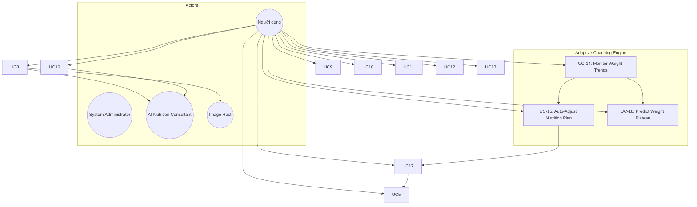
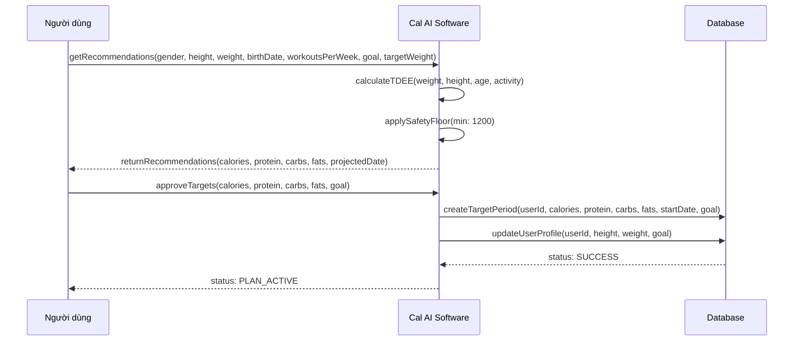
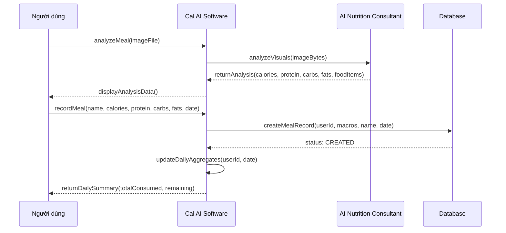
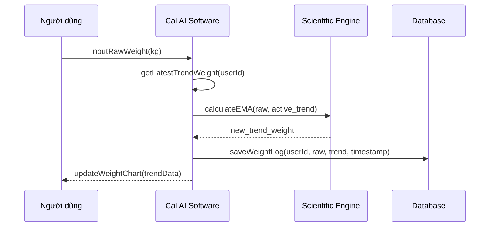
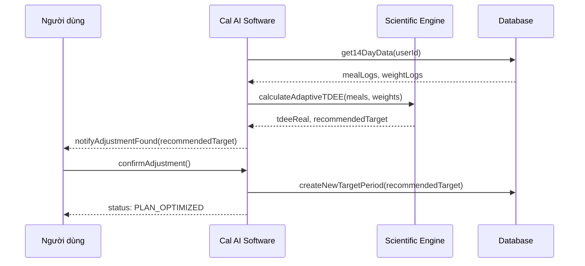
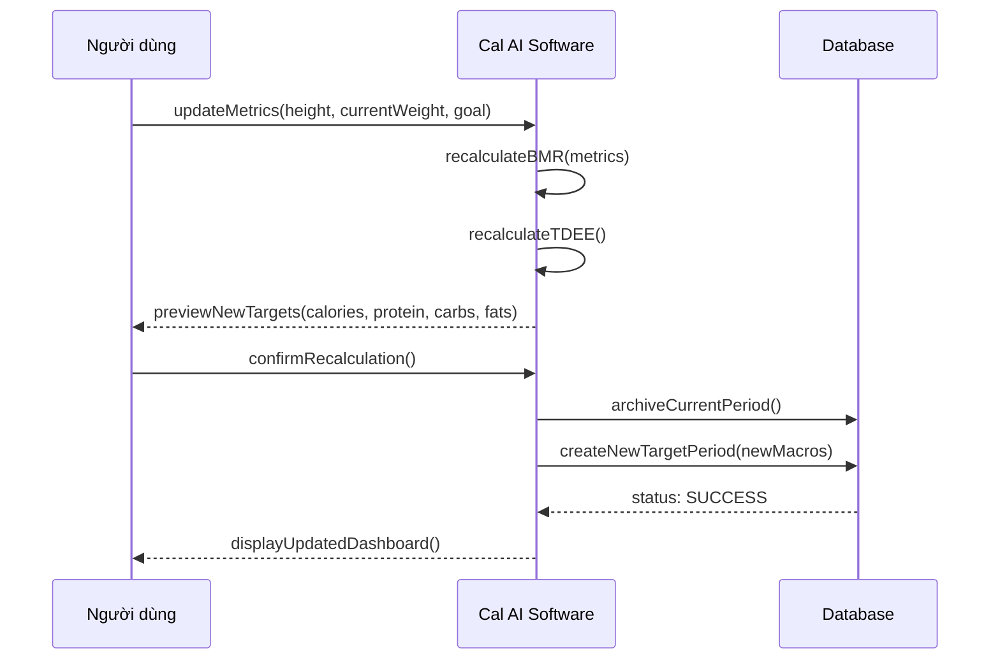

# Use Cases - Cal AI

## 1. Use Case Diagram

---

## 2. Use Case Descriptions

---

[SECTION REMOVED: System Procedures (Login/Register/Logout) are internal security measures and omitted from business use case analysis as per SQA requirements.]

---

---

### UC-5: Establish Nutrition Plan

| Field | Value |
|-------|-------|
| **Actor** | Người dùng (new) |
| **Precondition** | Người dùng is authenticated; targets are defaults |
| **Trigger** | App detects un-onboarded status on login |
| **Main Flow** | 1. Step 1: Select gender (male/female/other) 2. Step 2: Enter height (cm) 3. Step 3: Enter weight (kg) 4. Step 4: Enter birth date + workouts per week 5. Step 5: Select goal (weight_loss/muscle_gain/maintenance) 6. Step 5 (cont.): Enter target weight (if weight_loss or muscle_gain) 7. System calculates recommendations + projected date 8. Step 6: Người dùng reviews recommended goals, projected reach date, and approves |
| **Postcondition** | Người dùng Profile entry in DB populated; Active TargetPeriod created |
| **Exception** | E1: Người dùng exits before Step 6 -> No changes persisted. |

#### Sequence Diagram (UC-5)

---

### UC-6: Calculate Macro Targets

| Field | Value |
|-------|-------|
| **Actor** | System (triggered by UC-5 or UC-20) |
| **Main Flow** | 1. Calculate age from birth date 2. Map workouts/week to activity level (0-2: sedentary, 3-5: light, 6+: moderate) 3. Calculate BMR via Mifflin-St Jeor 4. Calculate TDEE = BMR * activity multiplier 5. Adjust for goal: loss = -500 (min 1200 kcal floor), gain = +500, maintenance = TDEE 6. Calculate protein (1.8-2.2 g/kg based on goal) 7. Calculate fats (0.9 g/kg) 8. Calculate carbs (remaining calories / 4) 9. Calculate Projected Date: (weight diff * 7700) / 500 shift 10. Return { macros, estimatedDays, projectedDate } |
| **Postcondition** | Recommendations + Goal ETA ready for review |

---

### UC-7: Approve Recommendations

| Field | Value |
|-------|-------|
| **Actor** | User |
| **Precondition** | Recommendations have been calculated |
| **Main Flow** | 1. User reviews calculated targets and Goal ETA 2. User clicks "Approve" 3. System saves profile metrics to User model 4. System closes current TargetPeriod (if any) and creates new active TargetPeriod |
| **Postcondition** | Onboarding complete; Dashboard targets synchronized |

---

### UC-8: Analyze Meal Photo

| Field | Value |
|-------|-------|
| **Actor** | User, Google Gemini AI, Image Host |
| **Precondition** | User is authenticated |
| **Actor** | User, Google Gemini AI (External), Image Host (External) |
| **Trigger** | User takes/uploads a meal photo |
| **Main Flow** | 1. Frontend sends image as multipart/form-data 2. Backend converts image to base64 3. Backend sends image + prompt to Gemini AI 4. AI returns JSON: { isFood, foodItems, calories, protein, carbs, fats, healthScore, confidence } 5. If isFood=true, backend uploads image to freeimage.host 6. Backend returns analysis with imageUrl |
| **Postcondition** | Analysis JSON returned to frontend; temporary ImageURL generated |
| **Exception** | E1: isFood=false -> Frontend shows "No food detected" alert E2: AI Timeout -> System prompts user to try again or enter manually E3: Image upload fails -> System continues with analysis result but sets `imageUrl` to null |

---

### UC-9: Record Food Intake

| Field | Value |
|-------|-------|
| **Actor** | Người dùng |
| **Precondition** | Người dùng has reviewed meal analysis (UC-8) |
| **Trigger** | Người dùng clicks "Confirm" in MealAnalysisModal |
| **Main Flow** | 1. Frontend sends meal data (name, foodItems, macros, imageUrl) 2. Backend calculates health score (use provided or compute from macro ratios) 3. Backend creates Meal record with current date/time 4. Backend recalculates daily summary 5. Returns updated DailySummary |
| **Postcondition** | Meal saved; dashboard updated with new consumed/remaining values |

#### Sequence Diagram (UC-9)

---

### UC-10: View Daily Summary

| Field | Value |
|-------|-------|
| **Actor** | Người dùng |
| **Trigger** | Dashboard loads or Người dùng selects a date |
| **Main Flow** | 1. Frontend requests GET /api/meals/daily-summary?date=YYYY-MM-DD 2. Backend fetches meals for the date 3. Backend fetches the latest TargetPeriod starting at or before the date 4. Backend calculates consumed (sum of meals) and remaining (target - consumed, min 0) 5. Returns { date, targets, consumed, remaining, meals } |
| **Postcondition** | Dashboard shows macro progress bars and meal list |

---

### UC-11: View Meal History

| Field | Value |
|-------|-------|
| **Actor** | Người dùng |
| **Trigger** | Người dùng opens History tab |
| **Main Flow** | 1. Frontend sends date range (startDate, endDate) 2. Backend fetches all meals and daily targets in range 3. Backend groups meals by date, calculates per-day summaries 4. Returns array of DailySummary sorted by date desc 5. Frontend renders history list + analytics charts (BarChart) |
| **Postcondition** | Người dùng sees historical nutrition data |

---

---

### UC-14: Monitor Weight Trends

| Field | Value |
|-------|-------|
| **Actor** | Người dùng, Scientific Engine |
| **Trigger** | Người dùng enters current scale weight |
| **Main Flow** | 1. Người dùng enters raw weight (kg) 2. System retrieves latest $W_{trend, t-1}$ 3. System applies EMA formula ($W_{trend, t} = \alpha \cdot W_{actual} + (1 - \alpha) \cdot W_{trend, t-1}$) 4. System stores both raw and trend weight 5. Dashboard updates with "Trend Weight" visualization |
| **Postcondition** | Weight history updated; noise filtered for coaching logic |

#### Sequence Diagram (UC-14)

---

### UC-15: Auto-Adjust Nutrition Plan

| Field | Value |
|-------|-------|
| **Actor** | Người dùng, Scientific Engine |
| **Trigger** | Weekly Check-in (or 14-day data threshold reached) |
| **Main Flow** | 1. System fetches `Avg(Calories_In)` and $\Delta W_{trend}$ for the last 14 days 2. System calculates $TDEE_{real}$ via Reverse Induction formula 3. System compares $TDEE_{real}$ with current target 4. If deviation > 5%, System proposes `NewTarget = TDEE_{real} + GoalOffset` 5. Người dùng reviews and clicks "Apply Adjustment" |
| **Postcondition** | TargetPeriod updated with scientifically verified macros |

#### Sequence Diagram (UC-15)

---

### UC-18: Predict Weight Plateau

| Field | Value |
|-------|-------|
| **Actor** | Người dùng, Scientific Engine |
| **Trigger** | TDEE calculation reveals significant metabolic slowdown |
| **Main Flow** | 1. System calculates adaptation ratio $R = TDEE_{real} / TDEE_{initial}$ 2. If $R < 0.9$, System flags potential plateau 3. Người dùng receives "Metabolic Alert" notification 4. System provides advice (Diet Break or Activity Boost) |
| **Postcondition** | Người dùng informed of biological adaptation before weight stalls |

---

### UC-12: Manage Health Profile

---

### UC-13: Update Target Plan

| Field | Value |
|-------|-------|
| **Actor** | Người dùng |
| **Main Flow** | 1. Người dùng adjusts Goal or Target Weight in Settings 2. System recalculates macros and projections 3. Người dùng clicks "Approve" 4. System saves profile metrics and initializes new TargetPeriod |
| **Postcondition** | New tracking phase started; dashboard updated |

---

### UC-16: Request Nutritional Advice

| Field | Value |
|-------|-------|
| **Actor** | Người dùng, AI Nutrition Consultant |
| **Trigger** | Người dùng navigates to Meal Chat and sends a message |
| **Main Flow** | 1. Frontend sends prompt + conversation history 2. Backend loads Người dùng's current daily summary (UC-10) 3. Backend builds prompt with: guardrails, client stats, history, user message 4. AI generates coaching response (<= 180 words, plain text) 5. Backend strips any markdown from response 6. Returns { reply } |
| **Postcondition** | Chat message displayed in UI; summary session context updated |
| **Exception** | E1: Người dùng asks for medical/pharmaceutical advice -> System triggers "Medical Disclaimer" guardrail response E2: AI safety filter trigger -> Generic "I cannot answer this" response |

#### Sequence Diagram (UC-16)

---

### UC-17: Recalculate Recommendations

| Field | Value |
|-------|-------|
| **Actor** | Người dùng |
| **Main Flow** | 1. Người dùng updates metrics in Settings 2. Người dùng clicks "Generate Recommendation" 3. System triggers calculation logic 4. Người dùng approves and updates global defaults |
| **Postcondition** | Targets updated; dashboard reflects new values |

#### Sequence Diagram (UC-17)

---

## 3. Actor-Use Case Matrix

| Use Case | Người dùng | System Admin | AI Nutrition Consultant | Image Host | Scientific Engine |
|----------|:----:|:-----:|:---------:|:----------:|:----------:|
| UC-5 Establish Plan | X | | | | |
| UC-8 Analyze Photo | X | | X | X | |
| UC-9 Record Food | X | | | | |
| UC-10 View Summary | X | | | | |
| UC-11 View History | X | | | | |
| UC-12 Manage Profile | X | | | | |
| UC-13 Update Plan | X | | | | |
| UC-14 Monitor Trends | X | | | | X |
| UC-15 Auto-Adjust | X | | | | X |
| UC-16 Request Advice | X | | X | | |
| UC-17 Recalculate | X | | | | |
| UC-18 Predict Plateau | X | | | | X |
