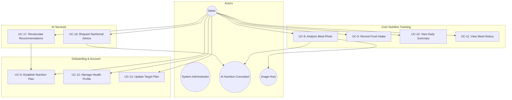
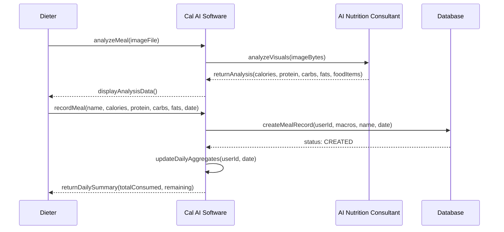
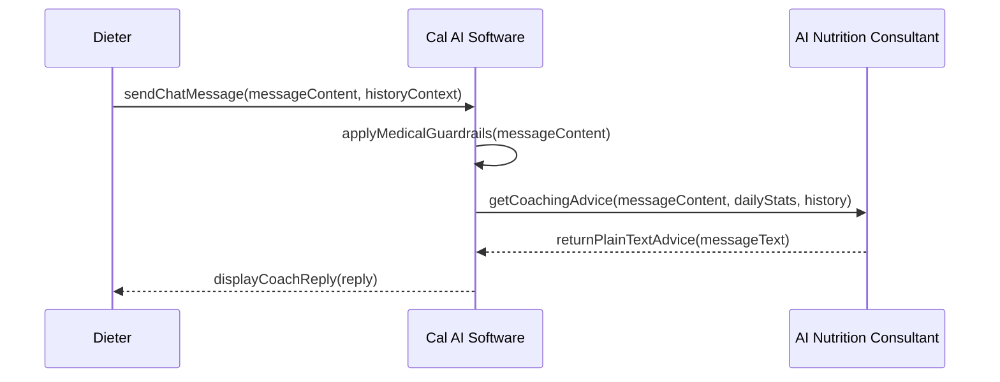

# Use Cases - Cal AI

## 1. Use Case Diagram

---

## 2. Use Case Descriptions

---

[SECTION REMOVED: System Procedures (Login/Register/Logout) are internal security measures and omitted from business use case analysis as per SQA requirements.]

---

---

### UC-5: Establish Nutrition Plan

| Field | Value |
|-------|-------|
| **Actor** | Dieter (new) |
| **Precondition** | Dieter is authenticated; targets are defaults |
| **Trigger** | App detects un-onboarded status on login |
| **Main Flow** | 1. Step 1: Select gender (male/female/other) 2. Step 2: Enter height (cm) 3. Step 3: Enter weight (kg) 4. Step 4: Enter birth date + workouts per week 5. Step 5: Select goal (weight_loss/muscle_gain/maintenance) 6. Step 5 (cont.): Enter target weight (if weight_loss or muscle_gain) 7. System calculates recommendations + projected date 8. Step 6: Dieter reviews recommended goals, projected reach date, and approves |
| **Postcondition** | Dieter Profile entry in DB populated; Active TargetPeriod created |
| **Exception** | E1: Dieter exits before Step 6 -> No changes persisted. |

#### Sequence Diagram (UC-5)

---

### UC-6: Calculate Macro Targets

| Field | Value |
|-------|-------|
| **Actor** | System (triggered by UC-5 or UC-20) |
| **Main Flow** | 1. Calculate age from birth date 2. Map workouts/week to activity level (0-2: sedentary, 3-5: light, 6+: moderate) 3. Calculate BMR via Mifflin-St Jeor 4. Calculate TDEE = BMR * activity multiplier 5. Adjust for goal: loss = -500 (min 1200 kcal floor), gain = +500, maintenance = TDEE 6. Calculate protein (1.8-2.2 g/kg based on goal) 7. Calculate fats (0.9 g/kg) 8. Calculate carbs (remaining calories / 4) 9. Calculate Projected Date: (weight diff * 7700) / 500 shift 10. Return { macros, estimatedDays, projectedDate } |
| **Postcondition** | Recommendations + Goal ETA ready for review |

---

### UC-7: Approve Recommendations

| Field | Value |
|-------|-------|
| **Actor** | User |
| **Precondition** | Recommendations have been calculated |
| **Main Flow** | 1. User reviews calculated targets and Goal ETA 2. User clicks "Approve" 3. System saves profile metrics to User model 4. System closes current TargetPeriod (if any) and creates new active TargetPeriod |
| **Postcondition** | Onboarding complete; Dashboard targets synchronized |

---

### UC-8: Analyze Meal Photo

| Field | Value |
|-------|-------|
| **Actor** | User, Google Gemini AI, Image Host |
| **Precondition** | User is authenticated |
| **Actor** | User, Google Gemini AI (External), Image Host (External) |
| **Trigger** | User takes/uploads a meal photo |
| **Main Flow** | 1. Frontend sends image as multipart/form-data 2. Backend converts image to base64 3. Backend sends image + prompt to Gemini AI 4. AI returns JSON: { isFood, foodItems, calories, protein, carbs, fats, healthScore, confidence } 5. If isFood=true, backend uploads image to freeimage.host 6. Backend returns analysis with imageUrl |
| **Postcondition** | Analysis JSON returned to frontend; temporary ImageURL generated |
| **Exception** | E1: isFood=false -> Frontend shows "No food detected" alert E2: AI Timeout -> System prompts user to try again or enter manually E3: Image upload fails -> System continues with analysis result but sets `imageUrl` to null |

---

### UC-9: Record Food Intake

| Field | Value |
|-------|-------|
| **Actor** | Dieter |
| **Precondition** | Dieter has reviewed meal analysis (UC-8) |
| **Trigger** | Dieter clicks "Confirm" in MealAnalysisModal |
| **Main Flow** | 1. Frontend sends meal data (name, foodItems, macros, imageUrl) 2. Backend calculates health score (use provided or compute from macro ratios) 3. Backend creates Meal record with current date/time 4. Backend recalculates daily summary 5. Returns updated DailySummary |
| **Postcondition** | Meal saved; dashboard updated with new consumed/remaining values |

#### Sequence Diagram (UC-9)

---

### UC-10: View Daily Summary

| Field | Value |
|-------|-------|
| **Actor** | Dieter |
| **Trigger** | Dashboard loads or Dieter selects a date |
| **Main Flow** | 1. Frontend requests GET /api/meals/daily-summary?date=YYYY-MM-DD 2. Backend fetches meals for the date 3. Backend fetches the latest TargetPeriod starting at or before the date 4. Backend calculates consumed (sum of meals) and remaining (target - consumed, min 0) 5. Returns { date, targets, consumed, remaining, meals } |
| **Postcondition** | Dashboard shows macro progress bars and meal list |

---

### UC-11: View Meal History

| Field | Value |
|-------|-------|
| **Actor** | Dieter |
| **Trigger** | Dieter opens History tab |
| **Main Flow** | 1. Frontend sends date range (startDate, endDate) 2. Backend fetches all meals and daily targets in range 3. Backend groups meals by date, calculates per-day summaries 4. Returns array of DailySummary sorted by date desc 5. Frontend renders history list + analytics charts (BarChart) |
| **Postcondition** | Dieter sees historical nutrition data |

---

### UC-12: Manage Health Profile

| Field | Value |
|-------|-------|
| **Actor** | Dieter |
| **Main Flow** | 1. Dieter navigates to Settings/Profile 2. System displays current info (height, weight, age, etc.) via `GET /api/users/me` 3. Dieter modifies any field 4. Dieter clicks "Save" 5. System validates and updates DB via `PUT /api/users/profile` |
| **Postcondition** | Dieter metadata updated in DB |
| **Exception** | E1: Validation error (e.g. invalid weight) -> System returns 400. |

---

### UC-13: Update Target Plan

| Field | Value |
|-------|-------|
| **Actor** | Dieter |
| **Main Flow** | 1. Dieter adjusts Goal or Target Weight in Settings 2. System recalculates macros and projections 3. Dieter clicks "Approve" 4. System saves profile metrics and initializes new TargetPeriod |
| **Postcondition** | New tracking phase started; dashboard updated |

---

### [REMOVED] UC-14: Set Custom Daily Target
Individual day target overrides are no longer supported. Users update their global plan which applies to today and onwards.

### [REMOVED] UC-15: Reset Daily Target to Default
Replaced by the continuous TargetPeriod system.

---

### UC-16: Request Nutritional Advice

| Field | Value |
|-------|-------|
| **Actor** | Dieter, AI Nutrition Consultant |
| **Trigger** | Dieter navigates to Meal Chat and sends a message |
| **Main Flow** | 1. Frontend sends prompt + conversation history 2. Backend loads Dieter's current daily summary (UC-10) 3. Backend builds prompt with: guardrails, client stats, history, user message 4. AI generates coaching response (<= 180 words, plain text) 5. Backend strips any markdown from response 6. Returns { reply } |
| **Postcondition** | Chat message displayed in UI; summary session context updated |
| **Exception** | E1: Dieter asks for medical/pharmaceutical advice -> System triggers "Medical Disclaimer" guardrail response E2: AI safety filter trigger -> Generic "I cannot answer this" response |

#### Sequence Diagram (UC-16)

---

### UC-17: Recalculate Recommendations

| Field | Value |
|-------|-------|
| **Actor** | Dieter |
| **Main Flow** | 1. Dieter updates metrics in Settings 2. Dieter clicks "Generate Recommendation" 3. System triggers calculation logic 4. Dieter approves and updates global defaults |
| **Postcondition** | Targets updated; dashboard reflects new values |

#### Sequence Diagram (UC-17)

---

## 3. Actor-Use Case Matrix

| Use Case | Dieter | System Admin | AI Nutrition Consultant | Image Host |
|----------|:----:|:-----:|:---------:|:----------:|
| UC-5 Establish Plan | X | | | |
| UC-8 Analyze Photo | X | | X | X |
| UC-9 Record Food | X | | | |
| UC-10 View Summary | X | | | |
| UC-11 View History | X | | | |
| UC-12 Manage Profile | X | | | |
| UC-13 Update Plan | X | | | |
| UC-16 Request Advice | X | | X | |
| UC-17 Recalculate | X | | | |
