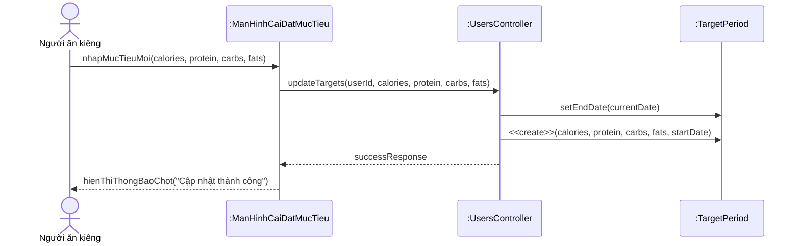
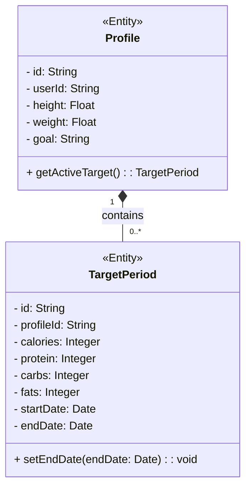

# BÁO CÁO ĐẢM BẢO CHẤT LƯỢNG (SQA): ÁP DỤNG QUY TẮC DÒ VẾT CHO UC-13

*(Chức năng: Cập nhật Kế hoạch Dinh dưỡng Hàng ngày / Set Custom Daily Targets)*

---

## CHƯƠNG III: PHÂN TÍCH HỆ THỐNG (Mô hình hóa nghiệp vụ)

### 1. Đặc tả Use Case (Chuẩn Academic)

| Mục | Nội dung chi tiết |
| :--- | :--- |
| **1. Thông tin chung** | |
| Mã Usecase | UC-13 |
| Tên Usecase | Cập nhật mục tiêu dinh dưỡng hàng ngày (Update Target Plan) |
| Tác nhân (Actors) | Người ăn kiêng |
| Mô tả ngắn | Cho phép `Người ăn kiêng` chủ động tùy chỉnh mục tiêu lượng Calo và các chất đa lượng (Macro) khi có sự thay đổi về thể trạng hoặc chiến lược cá nhân. |
| **2. Điều kiện tiên quyết (Pre-conditions)** | Người ăn kiêng đã đăng nhập và hệ thống đang có 1 bản ghi Mục tiêu (TargetPeriod) ở trạng thái `ACTIVE`. |
| **3. Điều kiện đảm bảo / Kết quả (Post-conditions)** | Bản ghi mục tiêu mới được khởi tạo và thiết lập trạng thái `ACTIVE`. Giao diện Dashboard được làm mới theo số liệu cập nhật. |
| **4. Luồng sự kiện chính (Basic Flow)** | 1. `Người ăn kiêng` truy cập Màn hình Cài đặt Mục tiêu. 2. `Người ăn kiêng` nhập các giá trị mới (Calories, Protein, Carbs, Fats). 3. `Người ăn kiêng` bấm nút *Lưu thay đổi*. 4. Lớp Controller kiểm định (Validate) tính hợp lệ của dữ liệu. 5. Lớp Controller khởi tạo (Create) bản ghi mục tiêu mới với các tham số đã nhập. 6. Lớp Controller thực hiện chốt thời điểm kết thúc cho mục tiêu cũ. 7. Giao diện thông báo thành công và chuyển hướng về Dashboard. |
| **5. Luồng rẽ nhánh / Ngoại lệ (Alternative Flows)** | **5.a) Dữ liệu vi phạm (Số âm)**: Tại bước 4, nếu người dùng nhập tham số âm (<0), Controller từ chối thao tác, báo lỗi *"Dữ liệu không hợp lệ"*. |

### 2. Lược đồ Tuần tự (Sequence Diagram - Định nghĩa tương tác)

*Quy tắc SQA: Lược đồ tuân thủ chuẩn tương tác Actor $\rightarrow$ Boundary $\rightarrow$ Control $\rightarrow$ Entity. Tập trung vào luồng nghiệp vụ của các Thực thể.*

---

## CHƯƠNG IV: THIẾT KẾ PHẦN MỀM (Mô hình hóa hệ thống)

### 1. Lược đồ Lớp (Class Diagram) - Conceptual Entity Model

*Quy tắc SQA: Lược đồ lớp mức Phân tích chỉ tập trung vào các Thực thể (Entities) mang dữ liệu. Loại bỏ các lớp kỹ thuật (DAO/Repository) để làm rõ mô hình nghiệp vụ.*

### 2. Độ phức tạp Cyclomatic (McCabe) - Kiểm thử hộp trắng

*Nhóm tiến hành phân tích độ phức tạp của hàm xử lý cốt lõi `UsersController.updateTargets` để xác định số lượng kịch bản kiểm thử tối thiểu bắt buộc.*

**Control Flow Graph (CFG) Analysis:**

1. Bắt đầu (Start)
2. Kiểm tra `calories >= 0 && calories <= 10000` (IF 1)
3. Kiểm tra `macros_total <= calories` (IF 2)
4. Lưu dữ liệu (Save)
5. Báo lỗi dữ liệu không hợp lệ (Error)
6. Kết thúc (End)

**Tính toán McCabe:**

- Số cạnh (edges): 7
- Số nút (nodes): 5
- Công thức: $V(G) = E - N + 2 = 7 - 5 + 2 = 4$.
- **Biện luận**: Hệ thống cần tối thiểu 4 Test Case để bao phủ 100% các luồng thực thi độc lập (basis paths).

---

## CHƯƠNG V: KIỂM SOÁT VÀ ĐẢM BẢO CHẤT LƯỢNG (V&V)

### 1. Ma trận Dò vết (Traceability Matrix)

*Bảng này là "xương sống" kết nối từ Yêu cầu nghiệp vụ $\rightarrow$ Thiết kế $\rightarrow$ Thực thi kiểm thử.*

| Mã Yêu cầu (SRS) | Lớp Xử lý / Thiết kế (DS) | Mã Kiểm thử (Test Cases) |
| :--- | :--- | :--- |
| **FR_13.1**: Cho phép người ăn kiêng nhập mục tiêu Calo/Macro. | `UsersController.updateTargets()` | **TC_13_Pos_01** |
| **FR_13.2**: Giá trị nạp vào bắt buộc phải là số dương ($\ge$ 0). | `MacroTargetsDto` (Validation) | **TC_13_Neg_01** |
| **FR_13.3**: Hệ thống phải bảo toàn lịch sử bằng cách đóng giai đoạn cũ. | `TargetPeriod.setEndDate()` | **TC_13_Pos_02** |

### 2. Thực hiện Verification (Rà soát thiết kế - Inspection)

*Nhóm tiến hành rà soát (Inspection) bản thiết kế API so với tài liệu Đặc tả Yêu cầu (SRS) để đảm bảo tính Toàn diện (Coverage) và tính Dẫn xuất (Derivation).*

| Tiêu chí Rà soát | Có trong Yêu cầu (SRS)? | Có trong Thiết kế (DS)? | Kết quả (Action) |
| :--- | :--- | :--- | :--- |
| Cập nhật Data vào bảng TargetPeriod | Có | Có | OK |
| Thuật toán chặn nhập số âm | Có | Có | OK |
| **Thuật toán chặn nhập quá 10,000 Calo** | **Không** | **Có** | **Xác minh lại (1)** |
| Lưu lịch sử Mục tiêu cũ | Có | Không | **Sửa lỗi thiết kế (2)** |

**Ghi chú SQA:**
- *(1) Vi phạm Tính Dẫn xuất*: Thiết kế tự ý thêm giới hạn 10,000 Calo trong khi SRS không yêu cầu. SQA yêu cầu cập nhật bổ sung SRS để thống nhất logic an toàn.
- *(2) Vi phạm Tính Toàn diện*: Thiết kế ban đầu quên định nghĩa hàm `setEndDate` cho bản ghi cũ. SQA yêu cầu bổ sung logic đóng giai đoạn (Closing period) vào Entity trước khi code.

### 3. Thực hiện Validation (Kiểm thử thực tế)

*Nhóm sử dụng kỹ thuật **Phân tích giá trị biên (Boundary Value Analysis)** và **Phân hoạch tương đương** để thực hiện Validation.*

| Mã Test Case | Kịch bản / Thao tác người dùng | Phản hồi của Hệ thống | Kết quả Validation |
| :--- | :--- | :--- | :--- |
| **TC_13_Pos_01** | Nhập Calo = 2000, P = 150 (Giá trị hợp lệ) $\rightarrow$ Lưu. | Database tạo `TargetPeriod` mới, Dashboard cập nhật số liệu. | **PASS** - Thỏa mãn FR_13.1 |
| **TC_13_Neg_01** | Nhập Calo = -1 (Giá trị biên dưới sai) $\rightarrow$ Lưu. | Hệ thống chặn và báo lỗi: "Calories must be positive". | **PASS** - Thỏa mãn FR_13.2 |
| **TC_13_Pos_02** | Thay đổi mục tiêu vào ngày 13/04. | Bản ghi mục tiêu cũ được cập nhật `endDate = 13/04`. | **PASS** - Thỏa mãn FR_13.3 |

> [!TIP]
> Bảng Validation này chứng minh phần mềm không chỉ đúng về mặt code mà còn đúng theo mong đợi thực tế của người dùng (Dieter).
