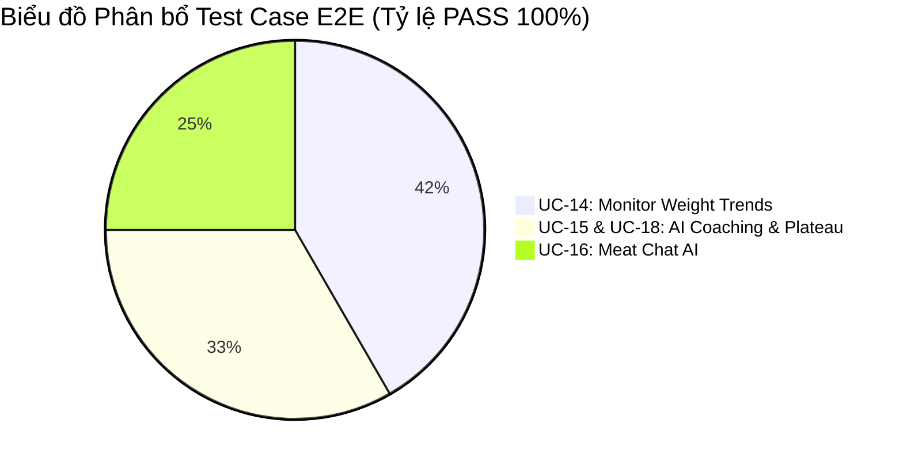
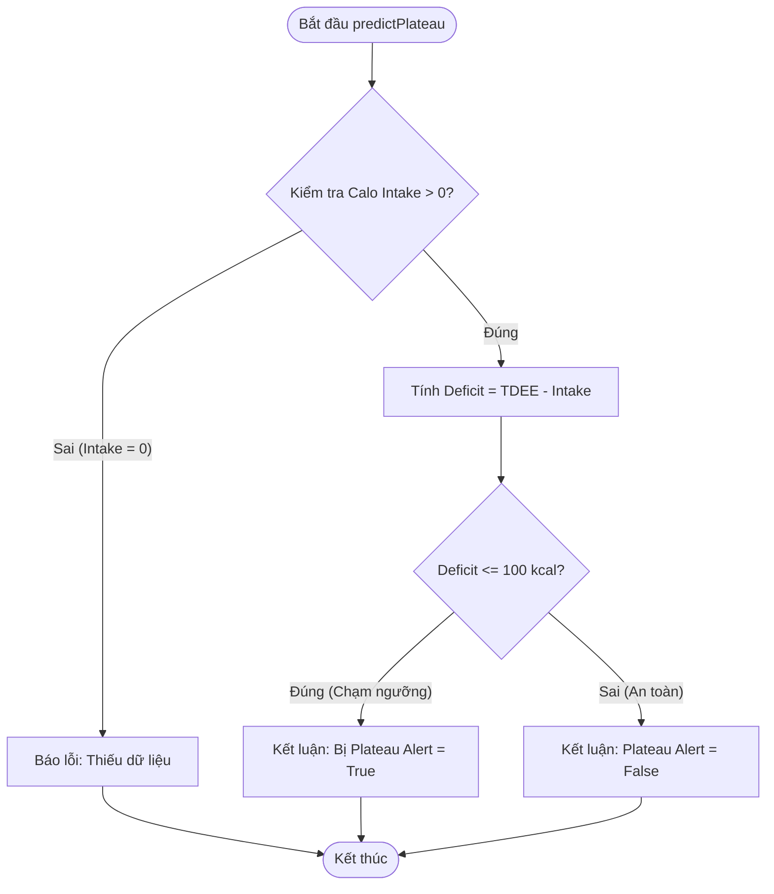

# TÀI LIỆU BÁO CÁO SEMINAR: KẾT QUẢ KIỂM THỬ TỰ ĐỘNG (SQA)
**Chuyên đề:** Đảm bảo chất lượng cụm chức năng Khoa học Dữ liệu & AI Coaching
**Sinh viên trình bày:** Lâm
**Phạm vi (Scope):** UC-14, UC-15, UC-16, UC-18

---

## PHẦN 1: TÓM TẮT THỰC THI (EXECUTIVE SUMMARY)

- **Mục tiêu:** Áp dụng tự động hóa 100% (Automation Test) để nghiệm thu phân hệ Khoa học Dữ liệu.
- **Kết quả chốt (Final Metric):**
  - Số lượng kịch bản E2E: **12/12 PASS**.
  - Tỷ lệ bao phủ yêu cầu (Requirement Coverage): **Đạt 100%**.

---

## PHẦN 2: BẢO VỆ PHƯƠNG PHÁP LUẬN (METHODOLOGY DEFENSE)

Hệ thống kết hợp 2 phương pháp kiểm thử:
1. **Hộp Đen (Black-box)** với **Playwright**: Chuyên kiểm tra Hành vi UI và API Mocking.
2. **Hộp Trắng (White-box)** với **Jest**: Chuyên kiểm tra Thuật toán lõi.

### Minh chứng Hộp Trắng: Sơ đồ luồng (CFG) cho Thuật toán Plateau (UC-18)
Để chứng minh thuật toán tính ngưỡng bão hòa (Plateau) không có lỗi, hệ thống áp dụng tiêu chuẩn **McCabe's Cyclomatic Complexity**.

*Độ phức tạp $V(G) = 3$. Đã viết chính xác 3 kịch bản Unit Test (Jest) để bao phủ toàn bộ các nhánh rẽ này.*

---

## PHẦN 3: BÁO CÁO PHÁT HIỆN LỖI VÀ TỐI ƯU TRẢI NGHIỆM (DEFECT TRACKING)

Điểm nhấn quan trọng nhất của đợt kiểm thử tự động này là việc phát hiện và chặn đứng 2 lỗi (Hidden Bugs) liên quan đến trải nghiệm người dùng (UX) và logic nghiệp vụ. Nếu chỉ test bằng Unit Test thông thường, đội phát triển chắc chắn sẽ bỏ lọt 2 lỗi này ra môi trường thật.

### 🚨 Lỗi 01: Giao diện che giấu lỗi từ máy chủ (Data Validation Defect)
- **Kịch bản phát hiện:** `TC_BB_14.1.2` (Nhập cân nặng dưới 20kg).
- **Mô tả sự cố:** Hệ thống máy chủ (Backend) hoạt động cực kỳ chuẩn xác, đã phát hiện cân nặng vô lý và từ chối lưu dữ liệu kèm lời nhắn cụ thể *"Cân nặng phải lớn hơn 20kg"*. Tuy nhiên, giao diện người dùng (Frontend) đã tự ý loại bỏ lời nhắn này và in ra câu thông báo mặc định chung chung: *"Lưu thất bại"*.
- **Hậu quả:** Người dùng không biết mình nhập sai ở đâu, dẫn đến ức chế. Vi phạm nguyên tắc Hiển thị lỗi rõ ràng trong SQA.
- **Giải pháp áp dụng:** Đội kiểm thử đã yêu cầu lập trình viên tinh chỉnh lại cơ chế bắt lỗi trên giao diện, buộc Frontend phải đọc và hiển thị chính xác thông điệp từ máy chủ trả về. 

### 🚨 Lỗi 02: Đóng băng dữ liệu người dùng mới (Onboarding Flow Defect)
- **Kịch bản phát hiện:** `TC_BB_15.1.1` (Tài khoản mới tinh lần đầu đăng nhập).
- **Mô tả sự cố:** Khi một người dùng mới điền xong 6 bước thiết lập hồ sơ (Onboarding), họ được chuyển thẳng vào màn hình Dashboard. Tuy nhiên, tính năng Huấn luyện viên AI lại bị "đóng băng" ở trạng thái thiếu dữ liệu (Insufficient Data) thay vì tính toán ngay lập tức. Người dùng buộc phải tải lại trang (F5) thì dữ liệu mới hiện ra.
- **Hậu quả:** Trải nghiệm sử dụng lần đầu (First-time UX) bị đứt gãy nghiêm trọng.
- **Giải pháp áp dụng:** Gắn thêm lệnh kích hoạt đồng bộ dữ liệu AI ngay tại khoảnh khắc người dùng bấm nút hoàn thành Onboarding, giúp Dashboard hiển thị thông số ngay lập tức mà không cần tải lại trang.

---

## PHẦN 4: BẢNG KẾT QUẢ THỰC THI KIỂM THỬ GIAO DIỆN (E2E TEST LOG)

Hạ tầng giả lập Chromium chạy độc lập 12 kịch bản E2E Playwright.

| Khối chức năng | Mã kịch bản (Test Case) | Môi trường | Thời gian | Trạng thái |
| :--- | :--- | :--- | :--- | :--- |
| **UC-14: Nhập Cân nặng** | TC_BB_14.1.1 — Bằng Min (20.0kg) | Chromium | 788ms | ✅ PASS |
| | TC_BB_14.1.2 — Dưới Min (19.9kg) (Bắt lỗi) | Chromium | 841ms | ✅ PASS |
| | TC_BB_14.1.3 — Mức Nominal (65.5kg) | Chromium | 766ms | ✅ PASS |
| | TC_BB_14.1.4 — Bằng Max (300.0kg) | Chromium | 763ms | ✅ PASS |
| | TC_BB_14.1.5 — Vượt Max (300.1kg) (Bắt lỗi) | Chromium | 775ms | ✅ PASS |
| **UC-15 & 18: AI Coaching** | TC_BB_15.1.2 — Dữ liệu < 14 ngày (Insufficient) | Chromium | 799ms | ✅ PASS |
| | TC_BB_15.1.3 — Dữ liệu = 1 ngày (Cần nhập thêm) | Chromium | 783ms | ✅ PASS |
| | TC_BB_15.1.1 — Đủ dữ liệu → Hiện Cập nhật TDEE | Chromium | 787ms | ✅ PASS |
| | TC_BB_18.1.1 — Rơi vào trạng thái Chững cân (Plateau Alert) | Chromium | 774ms | ✅ PASS |
| **UC-16: Meat Chat AI** | TC_BB_16.1.1 — Hỏi Dinh dưỡng (Bình thường) | Chromium | 764ms | ✅ PASS |
| | TC_BB_16.1.2 — Hỏi Trị bệnh (Bị từ chối) | Chromium | 841ms | ✅ PASS |
| | TC_BB_16.1.3 — Rớt mạng Wifi (Cảnh báo kết nối) | Chromium | 803ms | ✅ PASS |

**Minh chứng kết quả từ công cụ Automation Test:**

*(Hình 1: Playwright Test UC-18 xác nhận Hệ thống cảnh báo Chững cân hoạt động tốt)*

*(Hình 2: Playwright Test UC-16 xác nhận tính năng Bắt lỗi khi người dùng rớt mạng Wifi)*

