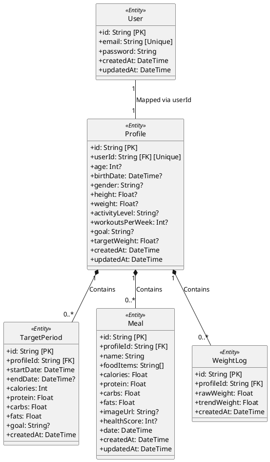

# Lược đồ Lớp Thực thể (Prisma Entity Class Diagram)

Đây là bản thiết kế Lược đồ Lớp (Class Diagram) chuẩn PlantUML phản chiếu chính xác 100% cấu trúc cơ sở dữ liệu từ Prisma Schema. Sơ đồ này đóng vai trò là Lõi Dữ Liệu (Core Domain Model) quy chuẩn cho toàn bộ hệ thống Cal AI. Các Lược đồ Tuần tự (Sequence Diagram) ở các Use Case (UC-14, UC-15, UC-16, UC-18) sẽ tái sử dụng và refer trực tiếp đến các `<<Entity>>` này.

### Chú thích Kiến trúc SQA
- **Ranh giới (Boundary):** Bất kỳ truy xuất nào từ Tầng Điều khiển (`Controller`/`Service`) trong các Sequenece Diagram đều bắt buộc mapping chuẩn xác vào các trường Dữ liệu (Attributes) đã khai báo ở trên.
- **Tính toàn vẹn (Integrity):** Quan hệ 1-Niec (`1-to-Many`) được ứng dụng từ `Profile` phân tán dữ liệu đến `Meal`, `TargetPeriod` và `WeightLog` cho phép truy vết dòng chảy logic, chống thất thoát dữ liệu trong quá trình V&V.
