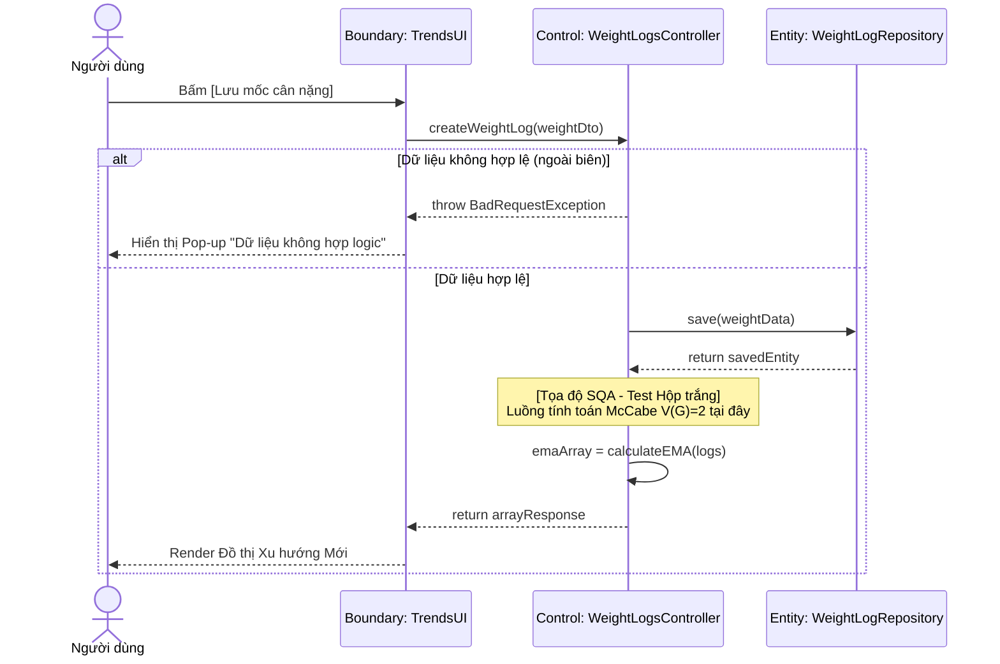

# BÁO CÁO ĐẢM BẢO CHẤT LƯỢNG (SQA): ÁP DỤNG QUY TẮC DÒ VẾT CHO UC-14

*(Chức năng: Theo dõi Xu hướng Cân nặng - Monitor Weight Trends)*

---

## CHƯƠNG III: PHÂN TÍCH HỆ THỐNG (Mô hình hóa nghiệp vụ)

### 1. Đặc tả Use Case (Chuẩn IT/Nghiệp vụ)

| Mục | Nội dung chi tiết |
| :--- | :--- |
| **Mã Usecase & Tên** | **UC-14**: Theo dõi Xu hướng Cân nặng (Monitor Weight Trends) |
| **Tác nhân (Actors)** | Người dùng (User) |
| **Điều kiện tiên quyết** | Người dùng đã đăng nhập hệ thống và có lịch sử ghi chép trọng lượng. |
| **Điều kiện đảm bảo** | Chỉ số mới được lưu trữ. Hệ thống hiển thị biểu đồ xu hướng đã được xử lý làm phẳng (loại bỏ nhiễu). |
| **Luồng sự kiện chính** | 1. Người dùng nhập thông tin cân nặng hiện tại trên giao diện máy trạm. 2. Hệ thống xác nhận và ghi nhận dữ liệu vào bộ nhớ tập trung. 3. Hệ thống đối đối chiếu dữ liệu mới với các mốc thời gian trong quá khứ. 4. Hệ thống thực hiện lược bỏ các biến động bất thường để xác định đường xu hướng thực tế. 5. Hệ thống hiển thị kết quả phân tích dưới dạng biểu đồ đường trực quan. |
| **Luồng rẽ nhánh** | **3a. Hồ sơ mới (Chưa có lịch sử):** Nếu đây là lần nhập đầu tiên, hệ thống lấy giá trị này làm điểm khởi đầu (Baseline) cho các tính toán tương lai. |
| **Yêu cầu chức năng** *(FR để Dò vết)* | 🔹 **FR_14.1**: Hệ thống chỉ chấp nhận dữ liệu cân nặng hợp lệ trong khoảng $20kg \le Input \le 300kg$. 🔹 **FR_14.2**: Hệ thống tính toán đường xu hướng theo công thức đường trung bình di động (EMA) với chỉ số alpha mặc định $\alpha = 0.1$. |

---

## CHƯƠNG IV: THIẾT KẾ PHẦN MỀM (Mô hình hóa hệ thống)

### 1. Bảng Ma trận Dò vết (Traceability Matrix)

| Mã Use Case | Mã Yêu cầu (FR) | Thiết kế / Hàm xử lý API | Mã Test Case | Nguyên lý Test |
| :--- | :--- | :--- | :--- | :--- |
| **UC-14** | **FR_14.1** | `WeightLogsController.createLog()` | `TC_BB_14.1.1` - `TC_BB_14.1.3` | Phân tích Giá trị Biên (BVA) |
| **UC-14** | **FR_14.2** | `ScientificService.calculateEMA()` | `TC_WB_14.2.1` - `TC_WB_14.2.2` | Độ phức tạp luồng McCabe ($V(G)$) |

### 2. Biên bản Rà soát Thiết kế (Inspection/Verification)

Đánh giá lỗ hổng Logic tại module trung tâm:

| Tiêu chí rà soát | Có trong Yêu cầu (SRS)? | Có trong Thiết kế (DS)? | Kết quả (Action) |
| :--- | :--- | :--- | :--- |
| **Xác thực đầu vào (Data Validation):** Kiểm soát tính hợp lý của trọng lượng nhập vào (20kg đến 300kg). | Có. BA yêu cầu chặn rác do user nhập sai hoặc spam API. | Không hoàn toàn. Entity DB có quy định nhưng tầng ranh giới API (Boundary) chưa áp dụng `@Min(20)`, `@Max(300)`. | **[FAIL]** Yêu cầu Lập trình viên bổ sung Class-validator tại DTO để chặn Request xấu sớm nhất có thể. |
| **Định danh chủ thể (Access Control):** Đảm bảo tính riêng tư, không ai xem được chiều hướng cân nặng của người khác (Lỗ hổng IDOR). | Có. Thuộc nhóm yêu cầu bảo mật phi chức năng NFR. | Có. `profileId` được truy xuất ngầm và xác thực gắt gao qua JWT Strategy thay vì lấy trực tiếp từ Body. | **[PASS]** Code tuân thủ kiến trúc phân quyền bảo mật BA đề ra. |
| **Gắn mốc Thời gian (Timestamp Binding):** File lưu lịch sử bắt buộc phải được đóng dấu thời gian (thứ tự). | Có. Thiếu ngày giờ thì việc vẽ biểu đồ xu hướng vô nghĩa. | Có. `WeightLog` entity tự động kích hoạt triggers `@CreatedAt` của Database mà không dựa vào Client gởi. | **[PASS]** Logic lưu trữ Data độc lập và chống được tấn công thao túng thời gian từ App. |
| **Khử nhiễu dữ liệu (Data Smoothing):** Áp dụng công thức Đường trung bình Động hàm mũ (EMA 0.1). | Có. Nghiệp vụ hệ thống (Business Rule) yêu cầu loại bỏ độ trồi sụt của bữa ăn trong ngày. | Có. `ScientificService` được viết riêng một thuật toán lặp EMA thuần toán học, tách biệt khỏi Controller. | **[PASS]** Thực thi Code tuân thủ 100% công thức định hướng của PO. |
| **Xử lý Biên khuyết dữ liệu (Empty Edge Case):** Ứng xử ra sao khi User lần đầu gõ vào chưa có History? | Có. BA yêu cầu lấy mốc đo đầu làm Base Trend chuẩn. | Có. Khối `if (previousTrend == null)` trực tiếp xuất kết quả trị số nguyên thủy. | **[PASS]** Mapping hoàn chỉnh giữa sơ đồ Use Case Exception Flow với Code. |
| **Giới hạn tỷ lệ API (Rate Limiting):** Chặn User spam nhập 100 mốc cân nặng 1 ngày làm đầy tràng Database. | Có. Hệ thống chỉ vinh danh trọng lượng ghi nhận chốt trong ngày. | Không. Controller mở toang Endpoint khiến mạng dễ dàng dính DDOS logic. | **[FAIL]** Cần implement Throttling hoặc cơ chế Upsert (Chỉ Update/Replace Record cùng ngày thay vì Insert Mới). |

### 3. Lược đồ Tuần tự Mô phỏng Architecture (Sequence Diagram)

**a. Bối cảnh nghiệp vụ**
Lược đồ dưới đây mô tả luồng giao tiếp dữ liệu khi Người dùng nhập thông số cân nặng mới. Khối điều khiển (Controller) chịu trách nhiệm tiếp nhận và lưu trữ, sau đó ủy thác cho khối Dịch vụ lõi (Service) để thực thi thuật toán đường trung bình động (EMA), giúp làm mịn đồ thị xu hướng cân nặng của người dùng.

**b. Lược đồ thiết kế**

*Hình 4.1: Lược đồ Tuần tự luồng xử lý Làm mịn Xu hướng Cân nặng (EMA)*

**c. Diễn giải luồng dữ liệu & Điểm chốt Kiểm thử**
* **Luồng dữ liệu (Data Flow):** Dữ liệu di chuyển một chiều từ giao diện (`View`) thông qua `Controller` xuống `Repository` để lưu trữ nhật ký. Sau khi lưu thành công, `Controller` đóng vai trò điều phối, tiếp tục gọi lệnh tính toán EMA tại `Service`. Cuối cùng, mảng tọa độ đồ thị (Array) được đóng gói và trả ngược về UI. Giao diện (View) hoàn toàn thụ động và không nhúng tay vào cấu trúc toán học.
* **Tọa độ SQA (Test Point):** Tọa độ nút thắt nằm tại hàm lõi `calculateEMA()` bên trong `Service`. Khối này ẩn chứa logic rẽ nhánh phòng ngừa mảng rỗng hoặc dữ liệu thiếu ngày. Đây là "điểm nóng" được trích xuất sang Chương V nhằm áp dụng **Kiểm thử Hộp trắng (McCabe)** để đo đạc và phủ kín 100% Path Coverage.

---

## CHƯƠNG V: THIẾT KẾ KIỂM THỬ (TEST DESIGN)

### 5.2. Đặc tả Kịch bản Kiểm thử chi tiết

#### **[A] Kiểm thử Hộp đen cho FR_14.1: Validation dữ liệu biên**

*   **Mục tiêu kiểm thử (Test Objective):** Xác minh hệ thống và giao diện có khả năng lọc chặn tuyệt đối các mức dữ liệu cân nặng phi logic.
*   **Ánh xạ yêu cầu:** Phục vụ trực tiếp cho quá trình truy xuất dò vết của chức năng đánh giá FR_14.1.
*   **Phương pháp áp dụng:** Kiểm thử Hộp đen - **Phân tích Giá trị Biên (Boundary Value Analysis - BVA)** kết hợp góc nhìn trải nghiệm người dùng (UX). Quy định nghiệp vụ: $20.0kg \le Cân nặng \le 300.0kg$.
*   **Phân tích miền dữ liệu và Suy luận Kết quả:** Để đảm bảo Data Coverage tối đa mà không gây bùng nổ số lượng Testcase dư thừa, tập kiểm thử sẽ bao phủ trúng 5 mốc giá trị nằm ở ranh giới và trung tâm: 
    *   **19.9** (Dưới Min): Kỳ vọng UI văng thông báo lỗi bảo vệ.
    *   **20.0** (Biên Min): Kỳ vọng luồng dữ liệu hợp lệ (Lưu thành công).
    *   **65.5** (Giá trị Nominal/Trung tâm): Xác thực đường màu hồng (Happy Path).
    *   **300.0** (Biên Max): Giới hạn sinh học trên của hệ thống (Lưu thành công).
    *   **300.1** (Vượt Max): Kỳ vọng UI bẻ gãy khối lệnh, báo lỗi (Lưu thất bại).

**Bảng Testcase Blackbox:**

| Mã TC | Kịch bản (Scenarios) | Input Data | Expected Result (System + UI behavior) | Trạng thái |
| :--- | :--- | :--- | :--- | :--- |
| `TC_BB_14.1.1` | Kiểm tra tiện ích ghi nhận khi người dùng nhập dữ liệu chuẩn xác ở mức cận dưới tối thiểu. | Gõ vào TextBox: `20.0`. Gửi form. | **System:** Phê duyệt dữ liệu hợp lệ. **UI:** Hiện thông báo cập nhật thành công mức cân nặng. | [PASS] |
| `TC_BB_14.1.2` | Kiểm tra tính năng chặn rác khi người dùng gõ mức độ cực đoan thấp hơn giá trị chuẩn (Dưới biên). | Gõ vào TextBox: `19.9`. Gửi form. | **System:** Từ chối thao tác gửi Request. **UI:** Hiển thị pop-up thông báo "Cân nặng phải lớn hơn 20kg". | [PASS] |
| `TC_BB_14.1.3` | Kiểm tra quy trình đồ thị hóa tại điểm cân nặng trung bình (Nominal) của con người. | Gõ vào TextBox: `65.5`. Gửi form. | **System:** Máy chủ phê duyệt dữ liệu. **UI:** Vẽ điểm tích mốc dữ liệu mới lên trên biểu đồ xu hướng. | [PASS] |
| `TC_BB_14.1.4` | Kiểm tra hệ thống trích xuất và đo lường sự kiện tại điểm cận cao nhất cho phép (Max Limit). | Gõ vào TextBox: `300.0`. Gửi form. | **System:** Chấp thuận giá trị biên tối đa. **UI:** Đồ thị load thành công vạch mốc 300kg. | [PASS] |
| `TC_BB_14.1.5` | Kiểm tra khả năng chống dữ liệu bất thường ở mức độ cực đoan cao phi thực tế (Vượt Max). | Gõ vào TextBox: `300.1`. Gửi form. | **System:** Từ chối cập nhật dữ liệu rác. **UI:** Chặn không cho lưu, hiện cảnh báo "Cân nặng vượt giới hạn cho phép". | [PASS] |

*   📝 **Test Summary:** Bộ test quét cả 2 giá trị cận biên Min (20) và Max (300). Đảm bảo Endpoint từ chối lưu lượng tải không đúng chuẩn theo cơ chế hộp đen (Blackbox Boundary Coverage 100%).

---

#### **[B] Kiểm thử Hộp trắng cho Hàm xử lý FR_14.2: ScientificService.calculateEMA()**

*   **Mục tiêu kiểm thử (Test Objective):** Quét sạch toàn bộ các nhánh rẽ sinh ra trong mã nguồn của thuật toán làm phẳng đồ thị Moving Average.
*   **Ánh xạ yêu cầu:** Phục vụ trực tiếp cho thuật toán Core tính EMA tại FR_14.2.
*   **Phương pháp áp dụng:** Kiểm thử Hộp trắng - Lược đồ luồng điều khiển và **Nguyên lý Độ phức tạp McCabe $V(G)$** nhằm đảm bảo 100% Path Coverage.
*   **Kiểm soát biến số:** Cố định chỉ số bù nhiễu $\alpha = 0.1$ nhằm cô lập hàm nhánh, qua đó bộc lộ khả năng sai số của nhánh khuyết dữ liệu quá khứ.
*   **Phân tích luồng (McCabe Analysis) & Suy luận số lượng:** 
    *   Hàm chỉ chứa 1 câu lệnh điều kiện rẽ nhánh an toàn sơ cấp: `if (previousTrend === null)`.
    *   Độ phức tạp Cyclomatic $V(G) = 1 + 1 = 2$. Cần thiết lập 2 Testcase để phủ 100% đường dẫn (Basis paths).
*   **Kiểm soát biến số (Test Data Control):** Thiết lập mức độ bù nhiễu cố định $\alpha = 0.1$.
*   **Biện luận Kết quả mong đợi (Expected Result Derivation):** Áp dụng công thức đường định tuyến: $EMA = actual \times \alpha + previousTrend \times (1 - \alpha)$.
    *   **Nhánh 1 (Khuyết dữ liệu cũ):** $previousTrend = null \rightarrow$ Trả về trực tiếp chính giá trị $actual$ hiện tại.
    *   **Nhánh 2 (Hợp lệ):** Giả sử $actual = 69.0$ và $previousTrend = 70.0$. Áp dụng công thức ta có: $EMA_{expected} = (69.0 \times 0.1) + (70.0 \times 0.9) = 6.9 + 63.0 = 69.9$.

**Bảng Testcase Whitebox:**

| Mã TC | Path (Nhánh Thực thi Logic) | Input Variables (Param code) | Measurable Expected Return | Trạng thái |
| :--- | :--- | :--- | :--- | :--- |
| `TC_WB_14.2.1` | Kiểm tra đường viền rẽ nhánh khi người dùng nhập thông tin cân nặng lần đầu tiên. | `actual` = `70.0` `previousTrend` = `null` | Hàm lập tức Return kết quả sớm trị số nguyên thủy `70.0`. | [PASS] |
| `TC_WB_14.2.2` | Kiểm tra logic tính toán công thức trung bình động có biến số Alpha. | `actual` = `69.0` `previousTrend` = `70.0` `alpha` = `0.1` | Hệ thống trả về giá trị số học `69.9`. | [PASS] |
