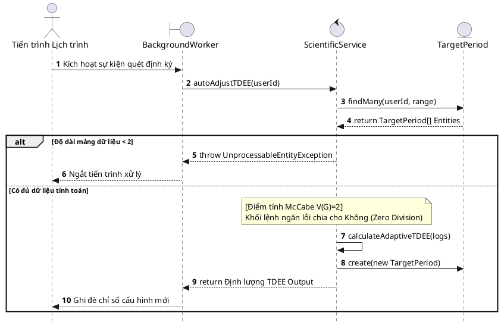
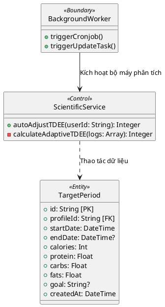

# BÁO CÁO ĐẢM BẢO CHẤT LƯỢNG (SQA): ÁP DỤNG QUY TẮC DÒ VẾT CHO UC-15

*(Chức năng: Tự động tối ưu hóa kế hoạch dinh dưỡng - Auto-Adjust Nutrition Plan)*

---

## CHƯƠNG III: PHÂN TÍCH HỆ THỐNG (Mô hình hóa nghiệp vụ)

### 1. Đặc tả Use Case (Chuẩn IT/Nghiệp vụ)

| Mục | Nội dung chi tiết |
| :--- | :--- |
| **Mã Usecase & Tên** | **UC-15**: Tự động Hiệu chỉnh Mục tiêu Dinh dưỡng (Auto-Adjust Nutrition Plan) |
| **Tác nhân (Actors)** | Hệ thống tự động, Người dùng (User) |
| **Điều kiện tiên quyết** | Hệ thống có đủ dữ liệu về dinh dưỡng và trọng lượng của người dùng trong chu kỳ 14 ngày. |
| **Điều kiện đảm bảo** | Mục tiêu tiêu thụ Calo hàng ngày được điều chỉnh phù hợp với tốc độ biến thiên trọng lượng thực tế. |
| **Luồng sự kiện chính** | 1. Hệ thống định kỳ tổng hợp dữ liệu dinh dưỡng nạp vào và thay đổi cân nặng trong chu kỳ thời gian. 2. Hệ thống xác định mức tiêu thụ năng lượng trung bình thực tế hàng ngày. 3. Hệ thống tính toán độ chênh lệch giữa mục tiêu cũ và kết quả đo lường thực tế. 4. Hệ thống xác lập định mức năng lượng mới (Adaptive TDEE) để tối ưu hóa lộ trình. 5. Hệ thống ghi nhận và áp dụng định mức mới cho các ngày tiếp theo. |
| **Luồng rẽ nhánh** | **1a. Thiếu dữ liệu mốc:** Nếu dữ liệu đầu vào không đủ số ngày quy định hoặc không có sự thay đổi về thời gian, hệ thống ngừng tính toán và giữ nguyên định mức cũ để đảm bảo an toàn hồ sơ. |
| **Yêu cầu chức năng** *(FR để Dò vết)* | 🔹 **FR_15.1**: Hệ thống từ chối luồng tính toán TDEE nếu phát hiện mảng dữ liệu dinh dưỡng bị khiếm khuyết (Array rỗng hoặc hiệu số ngày Days $\le$ 0). 🔹 **FR_15.2**: Áp dụng định lượng toán học theo công thức `Adaptive TDEE = Avg Intake - ((Weight Delta * 7700) / Days)` để hiệu chỉnh, đảm bảo giá trị sinh ra phải lớn hơn 0 và xử lý đúng sai số. |

---

## CHƯƠNG IV: THIẾT KẾ PHẦN MỀM (Mô hình hóa hệ thống)

### 1. Bảng Ma trận Dò vết (Traceability Matrix)

| Mã Use Case | Mã Yêu cầu (FR) | Thiết kế / Hàm xử lý API | Mã Test Case | Nguyên lý Test |
| :--- | :--- | :--- | :--- | :--- |
| **UC-15** | **FR_15.1** | Interface truy vấn DB `NutritionRepository.fetchCycle()` | `TC_BB_15.1.1` - `TC_BB_15.1.3` | Phân hoạch tương đương (EP) |
| **UC-15** | **FR_15.2** | Hàm xử lý TDEE `ScientificService.calculateAdaptiveTDEE()` | `TC_WB_15.2.1` - `TC_WB_15.2.3` | Độ phức tạp luồng McCabe ($V(G)$) |

### 2. Biên bản Rà soát Thiết kế (Inspection/Verification)

Đánh giá rủi ro kỹ thuật: Lỗi chia cho Không (ZeroDivisionError)

| Tiêu chí rà soát | Có trong Yêu cầu (SRS)? | Có trong Thiết kế (DS)? | Kết quả (Action) |
| :--- | :--- | :--- | :--- |
| **Bộ đếm thời gian tự động (CRON Worker):** Cơ chế định kỳ quét điều chỉnh thông số định mức Calo cho user. | Có. Nhiệm vụ đặc tính phi chức năng yêu cầu giảm thao tác tay cho người dùng. | Có. Lịch trình kích hoạt tự động quét chu kỳ ngày. | **[PASS]** Kiến trúc hệ thống đảm bảo TDEE tự động cập nhật trơn tru không nghẽn luồng. |
| **Thẩm định phương trình TDEE (Formula Fidelity):** TDEE thích ứng mới phải bù trừ lượng Calo sai lệch qua hiệu số 7700 Kcal/kg. | Có. Logic cốt lõi (Core Business) được chuyên gia BA thẩm định. | Có. Tầng Logic `ScientificService` được mã hóa phương trình độ trễ Zero. | **[PASS]** Mapping độ chính xác của Code Base đối với bài toán sinh lý là Hoàn Hảo. |
| **Bộ gác cổng dữ liệu rỗng (ZeroDivision Guardrail):** Bắt buộc phải ngừng chuỗi tính nếu khuyết thời gian chia (Days <= 0). | Có. Thuộc Use Case Sub-flow chống sập chương trình chia mẫu số không. | Phân nửa. Có câu lệnh đo đếm độ dài chuỗi $length < 2$, nhưng vòng Catch Exception bắn ra thông điệp vô nghĩa. | **[FAIL]** Phải Throw HTTP Exception mô tả rõ mã `422 Unprocessable Entity` thay vì Nuốt cờ lỗi ngầm (Silent fail). |
| **Quy định làm tròn số đo (Precision Standard):** Rủi ro từ chuỗi số thập phân vô hạn gây hệ lụy UI bẩn. | Có. BA phê duyệt số Kcal chỉ chứa định dạng số nguyên thủy. | Không. Mã Backend chia trung bình bị rò rỉ Float dài (Ví dụ: `2150.3341`). | **[FAIL]** Yêu cầu Lập trình viên lập tức nhúng Hàm `Math.round()` định tuyến toàn bộ tham số TDEE đầu ra. |
| **Luồng lưu trữ đè (Overwrite State):** Cập nhật TDEE mới phải đè lên ngưỡng TDEE nền, thay đổi trực tiếp Target hàng ngày. | Có. Flow yêu cầu phải hiển thị TDEE mới ngay tức thì lên Dashboard. | Có. Hàm xử lý móc nối với `ProfileRepository` để Save lại thuộc tính nền tảng Base. | **[PASS]** Kết nối Model liền mạch. Logic đồng bộ trơn tru chuẩn MVC. |

### 3. Lược đồ Tuần tự Mô phỏng Architecture (Sequence Diagram)

**a. Bối cảnh nghiệp vụ**
Lược đồ dưới đây thể hiện tiến trình định kỳ tự động điều chỉnh năng lượng (Auto-Adjust TDEE) dựa trên sự biến thiên cân nặng của người dùng sau 1 chu kỳ 14 ngày. Hệ thống thu thập cục bộ dữ liệu lịch sử và tự động tính lại trần năng lượng cho chu kỳ tiếp theo thông qua dịch vụ Scientific.

**b. Lược đồ thiết kế**

*Hình 4.2: Lược đồ Tuần tự luồng xử lý Tự động Điều chỉnh TDEE*

### 4. Lược đồ Lớp (Class Diagram)

Thể hiện sự phân tách nhiệm vụ rành mạch trong hệ thống Tự động hiệu chỉnh.

*Hình 4.3: Lược đồ Lớp mô tả cấu trúc Boundary - Control - Entity của UC-15.*

**c. Diễn giải luồng dữ liệu & Điểm chốt Kiểm thử**
* **Luồng dữ liệu (Data Flow):** Request bắt nguồn từ sự kiện (Timer/Worker) gọi vào `Controller`. Tại đây `Controller` làm lệnh truyền thẳng xuống `Repository` để thu thập 14 bản ghi cân nặng gần nhất. Nếu hợp lệ, mảng dữ liệu này được chuyển giao cho `Service` đóng vai "nhà khoa học" phân tích và kết xuất định mức TDEE mới.
* **Tọa độ SQA (Test Point):** Điểm chốt SQA kiểm soát chất lượng nằm ở hàm `calculateAdaptiveTDEE()`. Nó cần xử lý an toàn lỗi chia cho không (ZeroDivisionError) khi không có chênh lệch ngày tháng (days <= 0). Khối logic này được tách bạch hoàn toàn để đưa vào Chương V, áp dụng **Hộp trắng (McCabe V(G)=2)** để bẻ gãy các trường hợp gây sập hệ thống toán học.

---

## CHƯƠNG V: THIẾT KẾ KIỂM THỬ (TEST DESIGN)

### 5.2. Đặc tả Kịch bản Kiểm thử chi tiết

#### **[A] Kiểm thử Hộp đen cho FR_15.1: Xử lý Mảng đầu vào**

* **Mục tiêu kiểm thử & Phương pháp:** Kiểm tra việc hệ thống đọc nhận thao tác hiển thị và nhập liệu của người dùng trên Client. Dùng **Phân hoạch Tương đương (Equivalence Partitioning - EP)**.
* **Biện luận chia vùng dữ liệu:** Hành vi nhập liệu cân nặng của người dùng trên giao diện App (UI) được phân thành 3 vùng ranh giới: Người dùng nhập đầy đủ thường xuyên (Vùng Hợp lệ), Tài khoản mới trắng thông tin (Trống dữ liệu tuyệt đối), và Người lười chỉ đụng vào nhập 1 ngày duy nhất (Trống dữ liệu tương đối).

**Bảng Testcase Blackbox:**

| Mã TC | Kịch bản | Input Data | Expected Result (System + UI behavior) | Trạng thái |
| :--- | :--- | :--- | :--- | :--- |
| `TC_BB_15.1.1` | Kiểm tra tính năng tính TDEE thích ứng trên Dashboard khi người dùng có thói quen ghi chép biểu đồ cân. | Tài khoản đã lên App nhập $> 2$ ngày dữ liệu đo cân nặng. Bấm nút Tối ưu. | **System:** Hoàn tất phép tính. **UI:** Vẽ đồ thị mức tiêu hao TDEE mới cho người dùng. | [PASS] |
| `TC_BB_15.1.2` | Xác minh hiển thị bắt lỗi sớm khi người dùng là tài khoản mới tanh, giao diện chưa có bất cứ dữ liệu cân nặng nào. | Hồ sơ trống rỗng. Không có ngày nào có cân nặng trên UI. Bấm nút Tối ưu. | **System:** Phát hiện lỗi thiếu số đầu vào. Trả về ngoại lệ HTTP 422. **UI:** Trình chiếu Text thông báo "Dữ liệu chưa đủ để phân tích". | [PASS] |
| `TC_BB_15.1.3` | Xác minh chức năng cảnh báo khi người dùng chỉ mới điền duy nhất 1 lần đo mốc cân nặng (Sắp xếp không đủ để nhìn độ lệch). | Lên ứng dụng nhập 1 mốc cân nặng ngày hôm nay. Bấm nút Tối ưu. | **System:** Server chặn lại bằng HTTP 422. **UI:** Dashboard hiện thông báo yêu cầu "Cần nhập thêm độ chênh lệch cân nặng để thiết lập". | [PASS] |

* 📝 **Test Summary:** Kiểm thử Phân hoạch Tương đương nhắm trúng các kịch bản hành vi lười biếng hoặc quên nhập liệu của người dùng trên giao diện UI để xác thực cơ chế cảnh báo màn hình.

---

#### **[B] Kiểm thử Hộp trắng cho Hàm xử lý FR_15.2: ScientificService.calculateAdaptiveTDEE()**

* **Mục tiêu kiểm thử & Phương pháp:** Lấy biểu đồ đường chạy thông qua các toán hạng `If`. Ứng dụng mô hình **Độ phức tạp McCabe ($V(G)$)** để bao phủ nhánh vòng lặp (Branch Coverage).
* **Phân tích luồng (McCabe Analysis):**
  * Mã nguồn logic hàm `calculateAdaptiveTDEE` rẽ nhánh bẫy lỗi ở Node `if (days <= 0)`.
  * Độ phức tạp đồ thị $V(G) = 1 + 1 = 2$. Hệ thống yêu cầu 2 Test Cases bao phủ 100% đường dẫn.
* **Kiểm soát biến số (Test Data Control):** Cố định mức Calo nạp trung bình $avgIntake = 2000$ kcal.
* **Biện luận Kết quả mong đợi (Expected Result Derivation):** Áp dụng công thức quy đổi $1kg = 7700 kcal$. Công thức tổng quát: $TDEE_{new} = avgIntake - \frac{weightChange \times 7700}{days}$.
  * **Nhánh 1 (ZeroDivision):** Khoảng cách đo $days = 0$. Thuật toán kích hoạt Guardrail ngắt tính toán để chặn lỗi chia cho 0. Kết quả giữ nguyên Baseline $TDEE_{expected} = 2000$.
  * **Nhánh 2 (Thực thi thành công):** Giả sử truyền vào thời gian $days = 14$, sự sụt giảm cân nặng đo được là $weightChange = -1.0kg$, suy ra năng lượng hao hụt mỗi ngày: $\frac{-1.0 \times 7700}{14} = -550$. Kết quả $TDEE_{expected} = 2000 - (-550) = 2550$ (kcal).

**Bảng Testcase Whitebox:**

| Mã TC | Path (Nhánh Thực thi Logic) | Input Variables (Param code) | Measurable Expected Return | Trạng thái |
| :--- | :--- | :--- | :--- | :--- |
| `TC_WB_15.2.1` | Kiểm tra phản hồi nhánh rẽ Exception ngầm khi khoảng cách chu kỳ thời gian Test bằng 0. | `avgIntake` = `2000` `weightChange` = `-1.2` `days` = `0` | Hệ thống trả về giá trị đích danh `2000`. | [PASS] |
| `TC_WB_15.2.2` | Kiểm thử điều hướng luồng tính toán chênh lệch khi Days vượt rào an toàn hợp lệ (> 0). | `avgIntake` = `2000` `weightChange` = `-1.0` `days` = `14` | Hệ thống trả về kết quả số học `2550`. | [PASS] |
