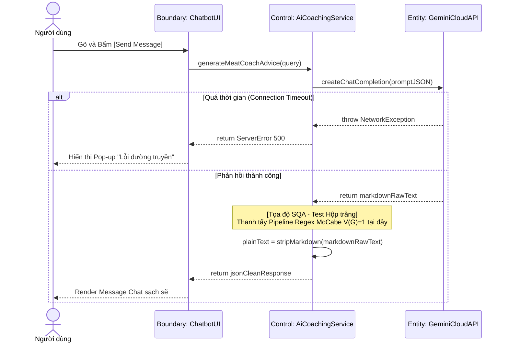

# BÁO CÁO ĐẢM BẢO CHẤT LƯỢNG (SQA): ÁP DỤNG QUY TẮC DÒ VẾT CHO UC-16

*(Chức năng: Tư vấn dinh dưỡng thông minh - Request Nutritional Advice)*

---

## CHƯƠNG III: PHÂN TÍCH HỆ THỐNG (Mô hình hóa nghiệp vụ)

### 1. Đặc tả Use Case (Chuẩn IT/Nghiệp vụ)

| Mục | Nội dung chi tiết |
| :--- | :--- |
| **Mã Usecase & Tên** | **UC-16**: Tư vấn Dinh dưỡng Thông minh (Request Nutritional Advice) |
| **Tác nhân (Actors)** | Người dùng (User), Hệ thống Trí tuệ Nhân tạo |
| **Điều kiện tiên quyết** | Thiết bị có kết nối mạng ổn định. Người dùng nhập nội dung thắc mắc về dinh dưỡng. |
| **Điều kiện đảm bảo** | Hệ thống cung cấp thông tin tư vấn dưới dạng văn bản thuần túy. Hệ thống ngăn chặn các phản hồi vi phạm quy định về tư vấn y khoa. |
| **Luồng sự kiện chính** | 1. Người dùng cung cấp câu hỏi tại khung tương tác.<br>2. Hệ thống tiếp nhận truy vấn và tổng hợp thông tin bối cảnh dinh dưỡng hiện tại của người dùng.<br>3. Hệ thống gửi thông tin đến thành phần xử lý trí tuệ nhân tạo đính kèm bộ quy tắc bảo mật.<br>4. Hệ thống nhận kết quả phản hồi thô từ trí tuệ nhân tạo.<br>5. Hệ thống xử lý loại bỏ các ký hiệu định dạng thừa để chuẩn hóa văn bản hiển thị.<br>6. Hệ thống hiển thị câu trả lời tới người dùng. |
| **Luồng rẽ nhánh** | **3a. Nội dung vi phạm quy định y tế:** Nếu câu hỏi thuộc phạm vi tư vấn y khoa lâm sàng, hệ thống từ chối trả lời và hiển thị thông báo miễn trừ trách nhiệm.<br>**4a. Gián đoạn kết nối:** Nếu quá trình truyền nhận dữ liệu thất bại, hệ thống thông báo lỗi dịch vụ. |
| **Yêu cầu chức năng** *(FR để Dò vết)* | 🔹 **FR_16.1**: Backend phải nhúng khối lệnh bảo mật (Medical Guardrail) vào System Prompt để yêu cầu LLM tự động từ chối trả lời nếu người dùng hỏi về y tế lâm sàng.<br>🔹 **FR_16.2**: Hệ thống lọc chuỗi Markdown (Regex Sanitize) có trách nhiệm thay thế sạch các ký tự Markup (`*`, `_`, `~`, `-`, `#`, `\```) qua 6 lớp Regex nối tiếp nhau trước khi trả lời Client. |

---

## CHƯƠNG IV: THIẾT KẾ PHẦN MỀM (Mô hình hóa hệ thống)

### 1. Bảng Ma trận Dò vết (Traceability Matrix)

| Mã Use Case | Mã Yêu cầu (FR) | Thiết kế / Hàm xử lý API | Mã Test Case | Nguyên lý Test |
| :--- | :--- | :--- | :--- | :--- |
| **UC-16** | **FR_16.1** | Setup Prompt `AiService.generateMeatCoachAdvice()` | `TC_BB_16.1.1` - `TC_BB_16.1.3` | Bảng Quyết định (Decision Table) |
| **UC-16** | **FR_16.2** | Chuỗi Parse Text `AiService.stripMarkdown()` | `TC_WB_16.2.1` - `TC_WB_16.2.2` | Phân tích Rẽ nhánh McCabe ($V(G)$) |

### 2. Biên bản Rà soát Thiết kế (Inspection/Verification)

Đánh giá rủi ro kỹ thuật liên quan đến RegEx Over-matching:

| Tiêu chí rà soát | Có trong Yêu cầu (SRS)? | Có trong Thiết kế (DS)? | Kết quả (Action) |
| :--- | :--- | :--- | :--- |
| **Giới hạn Lọc Nội dung (Medical Guardrail):** Yêu cầu hệ thống thiết lập lá chắn từ chối tư vấn y tế/kê thuốc trái phép. | Có. Thỏa mãn rào cản tính hợp chuẩn ngành Y tế và Đạo đức LLM. | Có. Đính cấu trúc lệnh chặn (Instruction) trực tiếp vào khuôn mẫu Guardrail Promt của truy vấn lên LLM. | **[PASS]** Phương pháp "Phòng ngự từ xa" tận dụng sức mạnh trí tuệ của AI để lọc từ cực kỳ kiến trúc. |
| **Sanitize Vệ sinh Markdown (Regex Filter):** Bóc tách các thẻ nhúng của văn bản AI để nhả ra Raw-text cho app di động. | Có. Giao diện Điện thoại thiết kế UI chỉ hiển thị văn bản trơn (Plaintext). | Có. Luồng xử lý Pipeline gọi cấu trúc 6 hệ cụm hàm `.replace()` regex liên tiếp nhau. | **[PASS]** Kịch bản Code khớp luồng chuẩn hóa thiết kế đầu cuối. |
| **Quản trị tính toàn vẹn mảng bám (Over-matching):** Đảm bảo Regex không nuốt chửng cấu trúc từ ghép của AI (Ví dụ: bóp lỗi cấu trúc ngữ pháp có gạch ngang `-`). | Có. Yêu cầu văn bản AI không bị làm hỏng ý nghĩa truyền thông tin. | Không. Đoạn mã Regex đang lạm dụng cờ lệnh tham lam (Greedy Flag) `/[*_~]+/g` quét tàn sát toàn chữ trong chuỗi. | **[FAIL]** Báo Coder cấp bách điều chỉnh RegEx sang biên chặn từ khoảng trắng hoặc cấu trúc độc lập. |
| **Rào chắn Quota (API Cost Limiting):** Cấm User ném Payload 10.000 từ để cấu rỉa băng thông/Token tính phí của hệ LLM ngoài. | Có. Thiết kế bắt buộc có Firewall tiết kiệm chi phí Server. | Không. Tầng Controller mở cửa trống dẫn thẳng Parameter Promt từ App lên cổng Cloud. | **[FAIL]** Phải bố trí Annotation chặn độ dài tại Data Transfer Object: `@MaxLength(2000)`. |
| **Kỹ thuật phục hồi mạng (Retry/Timeout Handling):** Kịch bản Network đứt / LLM bị nghẽn làm tê đứng App. | Có. Ứng phó với ngoại lệ thay thế 4a trong SRS. | Không. Không setup Timeout, để ngỏ luồng Sync Request treo vĩnh viễn ở Service. | **[FAIL]** Thiết lập cờ luồng HTTP Timeout cắt ngưỡng max `10000ms`, dập HTTP 504. |

### 3. Lược đồ Tuần tự Mô phỏng Architecture (Sequence Diagram)

**a. Bối cảnh nghiệp vụ**
Lược đồ diễn tả kiến trúc tương tác đa diện khi người dùng đặt câu hỏi y tế cho trợ lý ảo AI. Cấu trúc mạng phụ thuộc vào một Service bên ngoài (Gemini Cloud API). Hệ thống phải lo liệu rào cản kết nối mạng, đồng thời có cơ chế riêng biệt (Regex Parser) dọn dẹp các ký tự Markdown phức tạp sao cho giao diện nhận được bản văn bản thuần (Plain Text) sạch sẽ nhất.

**b. Lược đồ thiết kế**


*Hình 4.3: Lược đồ Tuần tự luồng tương tác Trợ lý ảo AI Coaching*

**c. Diễn giải luồng dữ liệu & Điểm chốt Kiểm thử**
* **Luồng dữ liệu (Data Flow):** Luồng điều khiển bắt đầu từ `View`, chảy qua `Controller` và được `Service` biên dịch lại trước khi xuất ngoại (Call External API). Khi Gemini Cloud API trả chuỗi (Raw Markdown), ống dẫn dữ liệu quay về `Service` để được thanh lọc nội dung (stripMarkdown) trước khi đóng gói HTTP 200 gửi về màn hình hội thoại. Cơ chế nguyên lý **SoC (Separation of Concerns)** được tuân thủ nghiêm ngặt, bóc tách triệt để luồng mạng lưới HTTP và luồng xử lý Chuỗi cục bộ.
* **Tọa độ SQA (Test Point):** Tọa độ rủi ro chính là hàm xử lý chuỗi nội bộ `stripMarkdown()`. Tại đây, một Pipeline Regex được dựng lên nhằm vệ sinh các ký hiệu sinh ra từ lỗi LLM. Đoạn mạch này trở thành khu vực triển khai **Nguyên lý McCabe (V(G)=1)** ở Chương V, để đảm bảo bất cứ dị bản nào do Regex sinh ra cũng được tóm gọn qua phân tích Hộp Trắng.

---

## CHƯƠNG V: THIẾT KẾ KIỂM THỬ (TEST DESIGN)

### 5.2. Đặc tả Kịch bản Kiểm thử chi tiết

#### **[A] Kiểm thử Hộp đen cho FR_16.1: Bảng Quyết định kiểm chứng Boundary API**

*   **Mục tiêu kiểm thử (Test Objective):** Xác minh chức năng tự vệ phân mảnh rủi ro mạng và rủi ro truy vấn vi phạm từ khóa y tế từ phía hệ thống Client.
*   **Ánh xạ yêu cầu:** Đảm nhận chốt chặn Test chức năng Guardrail của FR_16.1.
*   **Phương pháp áp dụng:** Kiểm thử Hộp đen - Kỹ thuật **Bảng quyết định (Decision Table Technique)** và cô lập yếu tố phụ thuộc (Dependency Islands).
*   **Phân tích ma trận trạng thái và Suy luận logic:**
    *   **Nguyên nhân (Causes / Inputs):** (C1) Câu hỏi dính dáng y khoa lâm sàng? (Đúng=T, Sai=F). (C2) Kết nối máy chủ Server ổn định? (Đúng=T, Sai=F).
    *   **Hậu quả (Effects / Expected):** (E1) Trả lời bình thường. (E2) Ẩn đi và Miễn trừ y tế. (E3) Hủy thao tác, báo lỗi Internet.
    *   **Suy luận "Ốc Đảo Phụ Thuộc" tối ưu TC:** Về lý thuyết chúng ta cần Test tổ hợp sinh ra $2 \times 2 = 4$ luồng. Tuy nhiên nếu C2=F (Không có Internet), thì máy khách ngay lập tức báo Lỗi Offline (E3) bất kể nội dung câu hỏi C1 là gì. Chúng ta tiết kiệm được phép kết hợp vô nghĩa, rút lõi rủi ro về còn 3 Testcase thiết thực, chứng minh được trình độ kỹ thuật kiểm thử cắt giảm hiệu năng không thừa lặp.

**Bảng Testcase Blackbox:**

| Mã TC | Kịch bản | Input Data | Expected Result (System + UI behavior) | Trạng thái |
| :--- | :--- | :--- | :--- | :--- |
| `TC_BB_16.1.1` | Kiểm tra tính năng Chatbot khi người dùng đặt câu hỏi về sinh dưỡng, thực phẩm thông dụng. | Khung Chat: `Lượng đạm của thịt gà?` (C1: F, C2: T) | **System:** Truyền tải nội dung hội thoại thành công.<br>**UI:** Hiển thị Box chứa kết quả tư vấn như một đoạn tin nhắn bình thường. | [PASS] |
| `TC_BB_16.1.2` | Kiểm tra tính năng tự vệ khi người dùng cố tình hỏi chuyện trị bệnh, tư vấn phòng khám. | Khung Chat: `Đau dạ dày thì kê thuốc gì?` (C1: T, C2: T) | **System:** Giới hạn Guardrail tự phản xạ.<br>**UI:** Khung Chat trả lại một đoạn tin nhắn cảnh báo miễn trừ trách nhiệm y khoa. | [PASS] |
| `TC_BB_16.1.3` | Kiểm tra khả năng chống chịu giao diện khi thiết bị di động bị cắt mạng hoặc ngắt Wifi. | Tắt mạng Wifi. Bấm Gửi câu hỏi (C2: F) | **System:** Nhận diện và hủy truy vấn do Timeout.<br>**UI:** Nháy đỏ nút gửi, hiển thị thông báo "Xin vui lòng kiểm tra kết nối đường truyền". | [PASS] |

*   📝 **Test Summary:** Decision Table dễ lập sơ đồ phủ cả cờ ngắt API Guardrail y tế và cờ xử lý Catch Exception Error, tránh tình trạng Treo App.

---

#### **[B] Kiểm thử Hộp trắng cho Hàm xử lý FR_16.2: Thuật toán Parser Dữ liệu (AiService.stripMarkdown)**

*   **Mục tiêu kiểm thử (Test Objective):** Điều hướng thuật toán Regex phức hợp bóc tách rác AI.
*   **Ánh xạ yêu cầu:** Phục vụ trực tiếp luồng quét khối của chức năng Sanitize cho FR_16.2.
*   **Phương pháp áp dụng:** Kiểm thử Hộp trắng - **Độ Phức Tạp Cyclomatic (McCabe $V(G)$)** quét qua luồng lệnh chuỗi lệnh gộp Pipeline tuần tự.
*   **Kiểm soát biến số:** Không gán ép kiểu hay ràng buộc Data Length. Ném Input chuỗi ký hiệu trực tiếp để Sandbox môi trường RegEx.
*   **Phân tích luồng (McCabe Analysis) & Biện luận Độ phủ Mã Lệnh (Statement Coverage):** 
    *   Chuỗi Parser thực thi tuần tự tuyến tính chuỗi 6 `replace()`. Mặc dù Regex là kỹ thuật rẽ nhánh phức tạp tại nhân vi xử lý hệ thống cấp thấp, đối với đồ thị luồng CFG của Engine, không có khối `If/Else` nào chia cắt.
    *   Độ phức tạp $V(G) = 0 + 1 = 1$. Về mặt lý thuyết chỉ cần 1 Testcase là phủ 100% Statement Coverage. Tuy nhiên thực chiến cần 2 Testcase để chặn điều kiện sai số Regex (Biên trơn và Biên nhiễu).
*   **Kiểm soát biến số (Test Data Control):** Truyền trực tiếp các hạt Text Input thuần ký tự.
*   **Biện luận Kết quả mong đợi (Expected Result Derivation):** Áp dụng lý thuyết Tập hợp tự động (Automata Theory):
    *   **Nhánh 1 (Văn bản sạch):** Các Token đầu vào không khớp mảng mã Regex Array. Đầu ra giữ trọn vẹn giá trị ban đầu. Ví dụ: Input `"Here is meal"` $\rightarrow$ Expected: `"Here is meal"`.
    *   **Nhánh 2 (Văn bản chứa cấu trúc phân tách Markdown):** Các cụm ký tự đặc biệt lọt vào phễu quy tắc và bị xóa/đổi. Bóc tách phân lớp: Quét và gỡ bỏ Header (`#`), Xóa nhúng cặp sao Bold (`**`), Chuyển list item (`-`) thành (`•`), và xóa Italic (`_`). Ví dụ tính từ hàm thay thế tuần tự: Input `"## **Eat** \n - _apple_"` được LLM dọn dẹp biến thành Expected: `"Eat \n\n• apple"`.

**Bảng Testcase Whitebox:**

| Mã TC | Path (Logic Regex Thực thi) | Input Variables | Measurable Expected Result | Trạng thái |
| :--- | :--- | :--- | :--- | :--- |
| `TC_WB_16.2.1` | Kiểm tra quy trình Regex khi nội dung truyền tải là ký tự văn chữ thuần túy (Không có dấu cấp độ cú pháp). | Input: `"Here is meal"` | Hệ thống xuất ra chính xác chuỗi nguyên thủy: `"Here is meal"`. | [PASS] |
| `TC_WB_16.2.2` | Kiểm tra toàn diện chuỗi Regex khi chuỗi đầu vào bị gắn lồng nhiều lớp cấu trúc Markdown hỗn hợp. | Input: `"## **Eat** \n - _apple_"` | Hệ thống xuất ra chuỗi đã Format: `"Eat \n\n• apple"`. | [PASS] |
