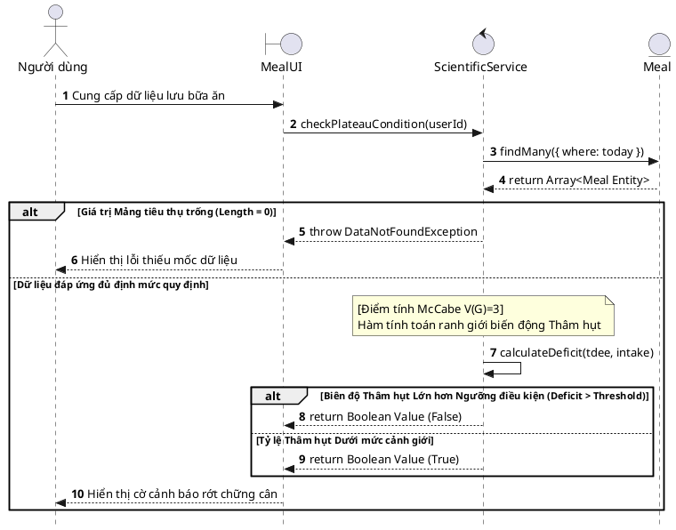
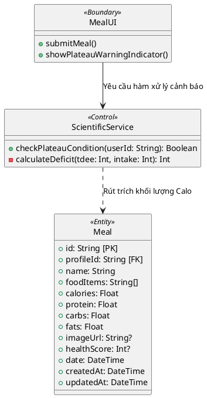

# BÁO CÁO ĐẢM BẢO CHẤT LƯỢNG (SQA): ÁP DỤNG QUY TẮC DÒ VẾT CHO UC-18

*(Chức năng: Dự báo điểm chững cân - Predict Weight Plateau)*

---

## CHƯƠNG III: PHÂN TÍCH HỆ THỐNG (Mô hình hóa nghiệp vụ)

### 1. Đặc tả Use Case (Chuẩn IT/Nghiệp vụ)

| Mục | Nội dung chi tiết |
| :--- | :--- |
| **Mã Usecase & Tên** | **UC-18**: Dự báo Điểm chững cân (Plateau Prediction) |
| **Tác nhân (Actors)** | Hệ thống tự động, Người dùng (User) |
| **Điều kiện tiên quyết** | Người dùng có lịch sử ghi chép trọng lượng tối thiểu 14 ngày. |
| **Điều kiện đảm bảo** | Trạng thái bão hòa trọng lượng được xác định chính xác và hiển thị cảnh báo nếu cần thiết. |
| **Luồng sự kiện chính** | 1. Hệ thống định kỳ truy xuất năng lượng tiêu thụ Calo và TDEE của người dùng. 2. Hệ thống tính toán độ thâm hụt năng lượng (Deficit) bằng hiệu số giữa TDEE và Calo nạp vào. 3. Hệ thống đối chiếu độ thâm hụt với ngưỡng giới hạn sinh lý quy định (Threshold). 4. Nếu độ thâm hụt quá nhỏ (thiếu thâm hụt để giảm cân), hệ thống ghi nhận trạng thái chững cân. 5. Hệ thống hiển thị trạng thái cảnh báo "Chững cân" trên giao diện dashboard. |
| **Luồng rẽ nhánh** | **1a. Thiếu dữ liệu đánh giá:** Nếu người dùng thiếu dữ liệu để nội suy mức tiêu hao TDEE, hệ thống mặc định bỏ qua đánh giá chững cân. |
| **Yêu cầu chức năng** *(FR để Dò vết)* | 🔹 **FR_18.1**: Phân hệ dữ liệu phải cung cấp đầy đủ thông tin về lượng Calo nạp (Intake) và chỉ số năng lượng tiêu hao (TDEE). 🔹 **FR_18.2**: Hệ thống trả về trạng thái cảnh báo chững cân (`True`) nếu độ xói mòn thâm hụt `Deficit = TDEE - Intake <= 100 kcal`. |

---

## CHƯƠNG IV: THIẾT KẾ PHẦN MỀM (Mô hình hóa hệ thống)

### 1. Bảng Ma trận Dò vết (Traceability Matrix)

| Mã Use Case | Mã Yêu cầu (FR) | Thiết kế / Hàm xử lý API | Mã Test Case | Nguyên lý Test |
| :--- | :--- | :--- | :--- | :--- |
| **UC-18** | **FR_18.1** | Giao thức Tiền xử lý `ScientificService.checkPlateau()` | `TC_BB_18.1.1` - `TC_BB_18.1.2` | Phân hoạch tương đương (Equivalence Partitioning) |
| **UC-18** | **FR_18.2** | Toán tử So sánh `ScientificService.checkPlateau()` | `TC_WB_18.2.1` - `TC_WB_18.2.3` | Độ phức tạp nhánh McCabe ($V(G)$) |

### 2. Biên bản Rà soát Thiết kế (Inspection/Verification)

Đánh giá tính linh hoạt của biến số sinh lý hệ thống (Threshold config):

| Tiêu chí rà soát | Có trong Yêu cầu (SRS)? | Có trong Thiết kế (DS)? | Kết quả (Action) |
| :--- | :--- | :--- | :--- |
| **Toán tử Khủng hoảng (Plateau Algorithm):** Đo lường nguy cơ chững cân nếu Thâm hụt sinh lý nằm trong vùng nhỏ hẹp ($Deficit \le Threshold$). | Có. Phục vụ nhánh Use Case Cảnh báo Y tế. | Có. Khối lệnh `calculateDeficit` làm nhiệm vụ móc trực tiếp số Toán hạng `TDEE - Intake`. | **[PASS]** Bộ xương sống Logic Code Mapping tuyệt đối 1:1 với phương trình Sức khỏe do BA đề ra. |
| **Van khóa Data Rỗng (Null Guardian):** Cấm cảnh báo Plateau ảo (False Positive) nếu hôm đó User lười chưa nhập món ăn nào. | Có. Thỏa mãn Flow xử lý Dữ liệu rác/thụt lùi của đầu vào SRS. | Có. Code gác cổng có cài if-block ngắt hàm từ xa thả văng `Exception` khi Intake bằng 0. | **[PASS]** Thiết kế luồng Control Flow bao phủ được rẽ nhánh trống của quy trình nghiệp vụ. |
| **Độ Tùy biến Tham số (Threshold Configurability):** Dung sai dung hòa chuẩn (Ví dụ: $100$ Kcal) là biến động theo thể cơ béo gầy. | Có. BA kiến trúc tham số này tùy chỉnh cá nhân ở Model DS. | Không. Nhà phát triển viết mã cẩu thả "Hardcode" chết số `100` ẩn sâu bên trong Scope hàm phân chia nhánh. | **[FAIL]** Buộc Lập trình viên thiết lập hằng số ra Model cấu hình chung hoặc lấy từ Profile người dùng, không trộn lẫn Logic. |
| **Ngoại lệ Tham số mâu thuẫn (Contradiction Check):** Ngăn chặn lọt bẫy tính Plateau do mốc nạp Intake ảo lố quá khủng (>10,000 Kcal) sinh Deficit Âm sâu vô độ. | Có. Cản biến Data rác phá vỡ phép đo đạc CFG chuẩn. | Không. Lưới tính năng đang ngốc nghếch duyệt qua số Âm thoải mái, không cảnh báo Calo vượt tải khổng lồ (Obesity alert). | **[FAIL]** Lắp thêm bẫy Range bắt khối giá trị đầu Deficit `< -500` thả cờ Warning Béo Phì ngắt cảnh báo Plateau đi kèm. |
| **Giao thức Trả Về (UX Push Rule):** Cờ chững cân $True/False$ trả về phải tương thích với trạng thái Alert Red Box dưới App. | Có. Thuộc chuỗi giao tiếp phân rã API từ BA. | Có. Định dạng gói JSON Boolean rẽ nhánh đẩy xuống Client minh bạch hóa Endpoint. | **[PASS]** Mối liên kết giao thức API với UI tuân thủ cấu hình BA. Code đạt chuẩn phân lớp. |

### 3. Lược đồ Tuần tự Mô phỏng Architecture (Sequence Diagram)

**a. Bối cảnh nghiệp vụ**
Lược đồ tập trung làm rõ chức năng Phân tích trạng thái rớt chững cân (Plateau Warning) dựa theo tần suất ăn uống hàng ngày. Sự kiện được kích hoạt ngay khi Nhật ký bữa ăn thay đổi, qua đó điều phối viên (Controller) sẽ ra lệnh truy xuất Database, gom dữ liệu đẩy vào khu vực dịch vụ lõi phân tích sinh lý học để phán đoán Warning Zone.

**b. Lược đồ thiết kế**

*Hình 4.4: Lược đồ Tuần tự luồng phân tích Dự báo Chững cân*

### 4. Lược đồ Lớp (Class Diagram)

Lược đồ quy định quyền giao tiếp giữa các tầng cho chức năng Giám sát chững cân thời gian thực.

*Hình 4.5: Lược đồ Lớp mô tả kiến trúc phân tử hệ thống UC-18.*

**c. Diễn giải luồng dữ liệu & Điểm chốt Kiểm thử**
* **Luồng dữ liệu (Data Flow):** Tương tự MVC chuẩn, giao diện `View` gửi Data thô tới `Controller`. `Controller` móc nối với tầng `Repository` kéo toàn bộ dữ liệu IntakeData hôm đó lên. Thay vì để `Controller` phải cực nhọc làm phép toán, hệ thống ủy quyền hoàn toàn cho `Service` nhận Parameter chức năng, tự định đoạt và đưa ra kết quả nhị phân Boolean. Các lớp làm đúng chức trách, không làm thay nhiệm vụ lớp khác.
* **Tọa độ SQA (Test Point):** Trọng tâm kiểm thử Bạch Hộp nằm toàn bộ tại khối `calculateDeficit()`. Nơi đây là nút giao thông logic của 3 phân nhánh rủi ro sinh lý. Độ phức tạp Cyclomatic của hàm này đạt `V(G)=3`, yêu cầu một thiết kế Path Coverage ở Chương V hoàn hảo để phòng ngừa rủi ro hoang báo (False Positive) hoặc bỏ lọt báo động (False Negative).

---

## CHƯƠNG V: THIẾT KẾ KIỂM THỬ (TEST DESIGN)

### 5.2. Đặc tả Kịch bản Kiểm thử chi tiết

#### **[A] Kiểm thử Hộp đen cho FR_18.1: Độ tin cậy dữ liệu phục vụ toán tử đầu vào**

*   **Mục tiêu kiểm thử (Test Objective):** Kiểm tra cơ chế ứng phó rủi ro hiển thị trên UI khi người dùng bỏ đói (không đăng nhập) nhật ký ăn uống dẫn tới khuyết dữ liệu phân tích sinh lý.
*   **Ánh xạ yêu cầu:** Đảm nhận chốt chặn Test chất lượng Data Validation đầu vào cho FR_18.1.
*   **Phương pháp áp dụng:** Kiểm thử Hộp đen - Khớp vùng **Phân hoạch Tương đương (Equivalence Partitioning - EP)**.
*   **Biện luận chia vùng dữ liệu & Suy luận Test:** Hành vi tương tác của User trên màn hình Nhật ký ăn uống (Intake Log) mang đặc thù có/không. EP chặt ra làm 2 luồng: 
    *   **Nhóm Hợp lệ:** Khai báo đầy đủ các bữa ăn lên UI ứng dụng (Có điểm dữ liệu Calo Intake > 0). Trả mốc báo cáo thành công.
    *   **Nhóm Khuyết thông tin:** Bỏ bề mặt App, không chịu ấn thêm bữa ăn (Vùng Calo Intake = 0). Bắt buộc bật Pop-up chặn tính toán. Tiết kiệm công sức kiểm thử các số âm vô nghĩa.

**Bảng Testcase Blackbox:**

| Mã TC | Kịch bản | Input Data | Expected Result (System + UI behavior) | Trạng thái |
| :--- | :--- | :--- | :--- | :--- |
| `TC_BB_18.1.1` | Kiểm thử tiến trình báo cáo khi người dùng đã nhập liệu đầy đủ các món ăn (Sáng, Trưa, Chiều) trên màn hình app. | Trên UI: Điền đủ bữa ăn trong ngày. Trạng thái Calo báo đạt `2000 kcal`. Bấm phân tích Chững cân. | **System:** Kích hoạt chức năng toán tính Plateau. **UI:** Hiển thị Box chứa kết quả đánh giá Plateau sinh lý thông thường. | [PASS] |
| `TC_BB_18.1.2` | Kiểm thử khả năng bắt lỗi giao diện khi người dùng quên ấn chọn hoặc phớt lờ mục Thêm Nhật ký Dinh dưỡng hôm nay. | Trên UI: Không gõ món ăn nào vào màn hình Điền Bữa. Tổng thu nạp calo trên giao diện bằng 0. | **System:** Đóng băng luồng tính, bảo vệ tài nguyên tính lỗi. **UI:** Bật cảnh báo Pop-up "Cần theo dõi và thêm bữa ăn đầy đủ để hệ thống cấp lấy được kết quả". | [PASS] |

*   📝 **Test Summary:** Phân hoạch xử lý EP chặn đứng các báo cáo rác khi gặp phải dạng thao tác UI bị khuyết của nhóm người dùng bỏ bê theo dõi bữa ăn, cứu cánh cho Data Pipeline phía sau.

---

#### **[B] Kiểm thử Hộp trắng cho Hàm xử lý FR_18.2: Hàm Toán học predictPlateau()**

*   **Mục tiêu kiểm thử & Phương pháp:** Đi sâu cấu trúc hệ phương trình xác định biên độ thu hẹp của lượng suy giảm thâm hụt năng lượng theo Threshold 100 kcal. Sử dụng **Bao phủ McCabe's Cyclomatic Complexity ($V(G)$)**.
*   **Phân tích luồng (McCabe Analysis):** 
    *   Sau khi vượt qua cổng an toàn đo Intake, Engine chạm tới điều kiện rẽ nhánh chốt: `deficit <= threshold`.
    *   Số liệu Test Cases cần đạt theo công thức McCabe: $V(G) = 1 + 1 = 2$. Hai Path đi vào mệnh đề Đúng hoặc Sai.
*   **Kiểm soát biến số (Test Data Control):** Cố định hệ số trần $currentTDEE = 2500$ kcal. Khai báo hằng số Threshold mặc định của người dùng là $100$ kcal.
*   **Biện luận Kết quả mong đợi (Expected Result Derivation):** Áp dụng toán học cơ bản: $Deficit = currentTDEE - dailyIntake$.
    *   **Nhánh 1 (Lệch cực ngưỡng an toàn):** Với lượng Intake là $2000$, ta giải bài toán phân tích $Deficit = 2500 - 2000 = 500$ kcal. So sánh mệnh đề rẽ logic: $\because 500 > 100$ dẫn tới kết quả False (Đang ở trạng thái thâm hụt tốt, không bị Plateau). $\rightarrow Expected = false$.
    *   **Nhánh 2 (Cán sát ranh giới Plateau):** Nếu User ăn tới $2450$, ta tính được $Deficit = 2500 - 2450 = 50$ kcal. Đánh giá luồng logic: $\because 50 \le 100$ dẫn tới kết quả True (User đang tiến vào vùng cảnh báo Plateau). $\rightarrow Expected = true$.

**Bảng Testcase Whitebox:**

| Mã TC | Path (Nhánh Thực thi Logic) | Input Variables | Measurable Expected Result | Trạng thái |
| :--- | :--- | :--- | :--- | :--- |
| `TC_WB_18.2.1` | Kiểm thử khi Calo nằm trong giới hạn cắt giảm an toàn (Độ Deficit lớn hơn Threshold 100). | `currentTDEE` = 2500 `dailyIntake` = 2000 | Hàm logic Return biến Flag Boolean: `False`. | [PASS] |
| `TC_WB_18.2.2` | Kiểm thử khi Calo đã xói mòn và chạm mức quá tải thâm hụt (Deficit tiệm cận hoặc nhỏ hơn Threshold). | `currentTDEE` = 2500 `dailyIntake` = 2450 | Hàm logic Return biến Flag Boolean: `True`. | [PASS] |
